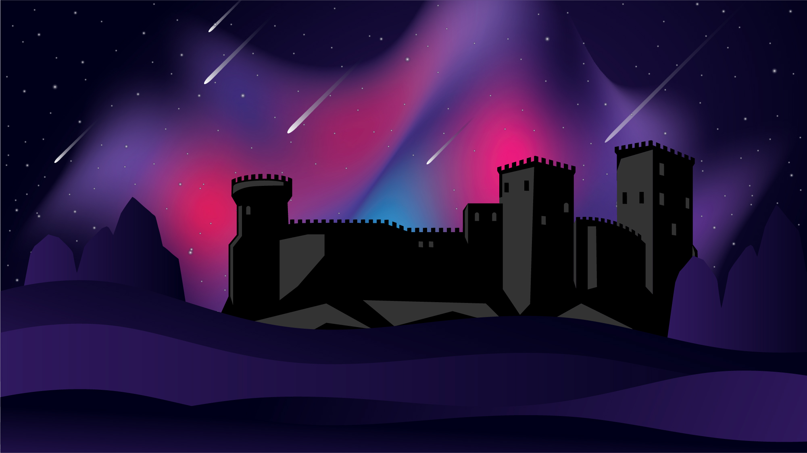

# 💡 Overview

## Realm of OGs

<figure><figcaption></figcaption></figure>

## A Game

The Realm is a real-life, on-chain board game where the players make the game.&#x20;

## With Players

Built on the Solana blockchain with an extensive token ecosystem and an unfolding roadmap, it is the actions of the participants that dictates how exactly the Realm evolves.&#x20;

## On Chain

The Realm exists primarily in block space, materialized through a series of SPL [tokens](physics/tokens/), web apps created to access the various functions of the game, and a heavily guarded [Discord](https://discord.gg/ogrealm) server housing the only known gathering place for OGs that exists behind the Realm's portal.

## The Objective

The objective of the game is to ascend through the layers of the Realm of OGs, eventually becoming the best version of OG possible according to the aspirations of each player.&#x20;

Some may become Builders, Nobles, Kings.&#x20;

Some may accumulate riches of Realm [tokens](physics/tokens/), but never sit at the Knight's table.&#x20;

Some may lurk in the shadows, yet somehow grow ever more powerful from their perch.&#x20;


It is up to each OG to determine and pursue their own objectives in the Realm.

