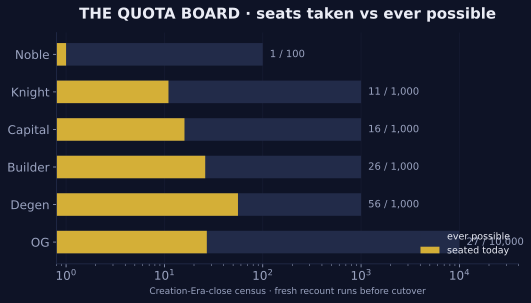

# Onchain Status

The Realm's living dashboard. Every figure on this page is read from the chain and refreshed on schedule; everything else in this book is law, and this page is *now*.

## The Clock

| Counter | Value |
| --- | --- |
| ☀️ Universal Epoch | **UEC 702** · Era II, Epoch 3 |
| 🛕 Mine Epoch | 677 *(UEC − 25)* |
| 🏛️ Reserve Epoch | 564 *(UEC − 138)* |
| 🎰 Lottery Epoch | 203 *(UEC − 499)* |
| Next horizon | 🪂 UEC 904 — the [Alchemy Airdrop](../era-2/alchemy-airdrop.md) (202 Epochs away) |

## The Engines

| Engine | Badge | Note |
| --- | --- | --- |
| 🛕 Mine emissions | 🟢 EMITTING | 1% of remaining vault per Epoch |
| 🏛️ Reserve emissions | 🟢 EMITTING | 274M $OGC per Epoch, constant |
| 🎰 Lottery releases | 🟢 RELEASING | accelerating per Epoch |
| Mine repurchase | 🟢 ACTIVE | buys $OGG |
| Reserve repurchase | 🟠 UNDER REPAIR | by sovereign order |
| Lottery repurchase | ⚪ COMING | will burn $OGF |
| $OGC fee path | 🟠 UNDER REPAIR | fees in SOL meanwhile |

## The Difficulty Law

The one fee law (full formula on the [Difficulty](../physics/difficulty.md) page). Live base fees: **Mine ≈ 0.0012 SOL · Reserve ≈ 0.0014 SOL**. Landmark: the 1,000th player of a period pays about **1 SOL**.

## 👤 The Quota Board

| Class | Ever possible | Sworn token |
| --- | --- | --- |
| 📚 Noble | 100 | $OGA (1%) |
| 🛡️ Knight | 1,000 | three tokens (0.1% each) |
| 💰 Capital | 1,000 | $OGG (0.1%) |
| 🧱 Builder | 1,000 | $OGC (0.1%) |
| 🎲 Degen | 1,000 , falling | $OGF (0.1%) |
| 💎 OG | 10,000 | $OGC (0.01%) |

<figure><figcaption>The Quota Board — how many of each class can ever exist</figcaption></figure>

*Live **seated** counts are being collected from the Realm's authoritative class source (Matrica Discord roles + onchain liquid census) and will publish here once verified. The **ever-possible** ceilings above are fixed by supply and threshold — exact and eternal.*


**Refresh doctrine:** this page is regenerated by the Realm's pipeline (`06_DOCS_V2/gen_status_page.py`) and stamped with its verification Epoch. If the stamp below trails the current UEC by more than a few Epochs, the chain itself — one click away throughout this book — is always current.


---

*✓ Structure verified by the Mad OG · live data auto-generated by the pipeline hook · snapshot UEC 702 (2026-06-06)*
