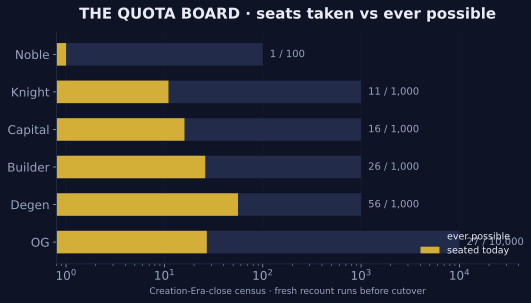

# 📡 Onchain Status

The Realm's living dashboard. Every figure on this page is read from the chain and refreshed on schedule; everything else in this book is law, and this page is *now*.

## The Clock

| Counter | Value |
| --- | --- |
| ☀️ Universal Epoch | **UEC 818** · Era II, Epoch 119 |
| 🛕 Mine Epoch | 793 *(UEC − 25)* |
| 🏛️ Reserve Epoch | 680 *(UEC − 138)* |
| 🎰 Lottery Epoch | 319 *(UEC − 499)* |
| Next horizon | 🪂 UEC 904 — the [Alchemy Airdrop](../era-2/alchemy-airdrop.md) (86 Epochs away) |

## The Living Face

The Book is law; the **Face** is *now*. Every figure below is also read live — every 30 minutes, from Solana — on [ogrealm.com](https://ogrealm.com): the [Oracle](https://ogrealm.com/oracle) (worth · engines · society), the [Games](https://ogrealm.com/games) (Proof of Emission), the [Ledger](https://ogrealm.com/ledger) (Proof of Reserves), the [Census](https://ogrealm.com/census) (Proof of Population), the [Watchtower](https://ogrealm.com/status), and the [Wire](https://ogrealm.com/saga/wire) (the raw stream). Agents read the same truth at [`/api/state`](https://ogrealm.com/api/state).

## The Engines

| Engine | Badge | Note |
| --- | --- | --- |
| 🛕 Mine emissions | 🟢 EMITTING | 1% of remaining vault per Epoch |
| 🏛️ Reserve emissions | 🟢 EMITTING | 274M $OGC per Epoch, constant |
| 🎰 Lottery releases | 🟢 RELEASING | accelerating per Epoch |
| Mine repurchase | 🟠 DORMANT | reforging — since Jan ’25; ≈99M $OGG reloaded across 9,269 buys before it slept |
| Reserve repurchase | 🟠 UNDER REPAIR | by sovereign order |
| Lottery repurchase | ⚪ COMING | will burn $OGF |
| $OGC fee path | 🟠 UNDER REPAIR | fees in SOL meanwhile |

## The Difficulty Law

The one fee law (full formula on the [Difficulty](../physics/difficulty.md) page). Live base fees: **Mine ≈ 0.0012 SOL · Reserve ≈ 0.0014 SOL**. Landmark: the 1,000th player of a period pays about **1 SOL**.

## 👤 The Quota Board

| Class | Seated | Ever possible |
| --- | --- | --- |
| 📚 Noble | 0 | 100 |
| 🛡️ Knight | 16 | 1,000 |
| 💰 Capital | 7 | 1,000 |
| 🧱 Builder | 4 | 1,000 |
| 🎲 Degen | 3 | 1,000 |
| 💎 OG | 13 | 10,000 |

<figure><figcaption>The Quota Board — how many of each class can ever exist</figcaption></figure>

*verified census UEC 818 — 43 citizens (census_finalize.py)*


**Refresh doctrine:** this page is regenerated by the Realm's pipeline (`06_DOCS_V2/gen_status_page.py`) and stamped with its verification Epoch. If the stamp below trails the current UEC by more than a few Epochs, the [Face](https://ogrealm.com/oracle) and the chain itself — one click away throughout this book — are always current.


---

*✓ Structure verified by the Mad OG · live data auto-generated by the pipeline hook · snapshot UEC 818 (2026-09-30)*
