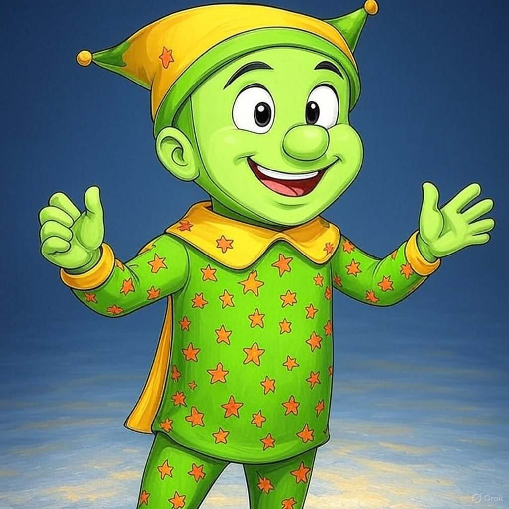

# 🧠 Knowledge Base

## Information Database

The Knowledge Base is a central intelligence hub for the Realm of OGs. It serves both as a storage facility for the growing complex of information generated from the activities within the Realm, as well as a functional database that is accessible to both humans and non-humans.

## Content Storage

Currently Integrated:

1. Docs ([https://docs.ogrealm.xyz](https://docs.ogrealm.xyz/))

Over time, content stored within the Knowledge Base will grow.

## Logic Extensions

Generally, contents added to the Information Database are done so in human-readable format. While this is a satisfactory default, its functionality depends on the Knowledge Base's ability to decipher the information (many times in a non-human-readable format). Thus, the Knowledge Base serves as a vital extension to Artificial Intelligence tools utilized by the Realm.

### NPCs (Non-Player Characters)

NPCs are characters that are not controlled by an OG or player, but rather by a computer system or artificial intelligence with predetermined behaviors. They can be essential to the game's story, assist players, or simply add to the game world.

#### Jester

Jester is the Realm's first NPC, has access to the entire Knowledge Base, and is accessible via [Discord](https://discord.gg/ogrealm).

<figure><figcaption></figcaption></figure>

> Jester is your typical, lovable town idiot.&#x20;
>
> He hangs out in the ⁠Arena and loves to interact with anyone who chooses to engage.&#x20;
>
> He's generally pretty jolly, mostly helpful, and loves to share and impress.
>
> But make no mistake, Jester isn't actually an idiot.&#x20;
>
> He's been around the Realm for a very long time.
>
> And he can enlighten you on the ins and out--if you know what to ask.

Jester v0.1. Abilities will improve with subsequent versions.
