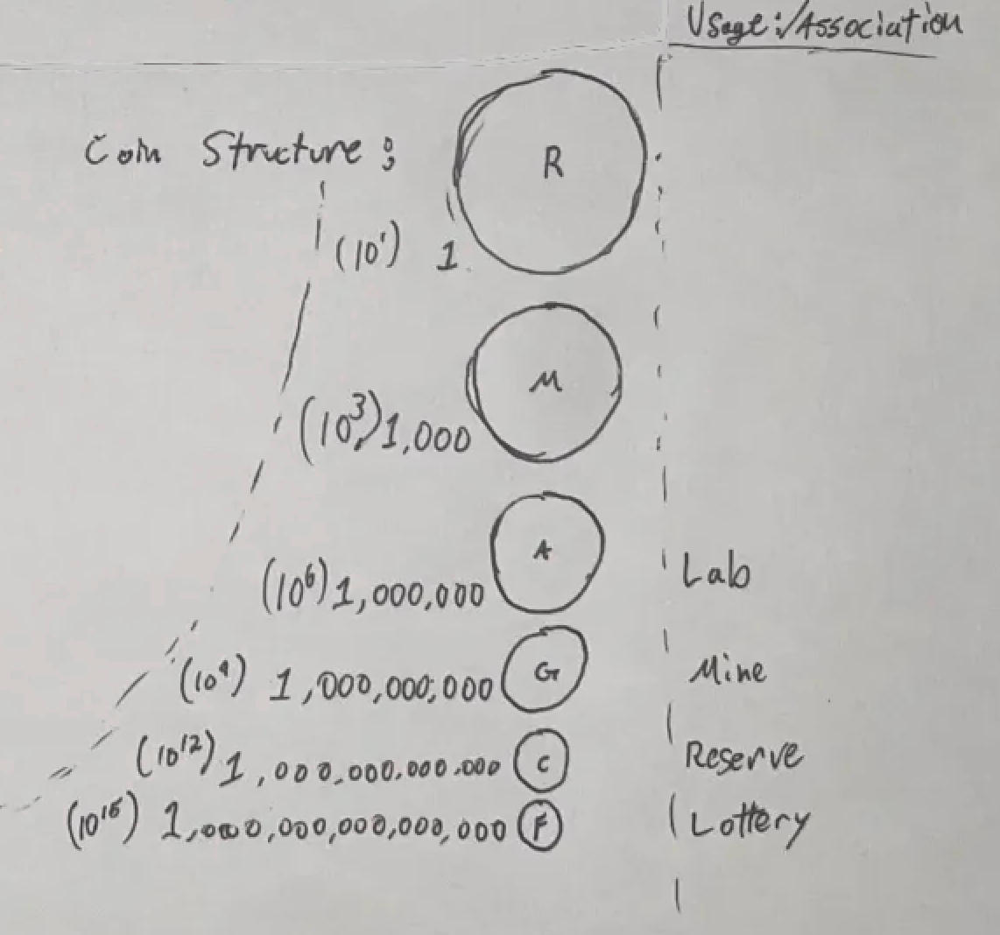
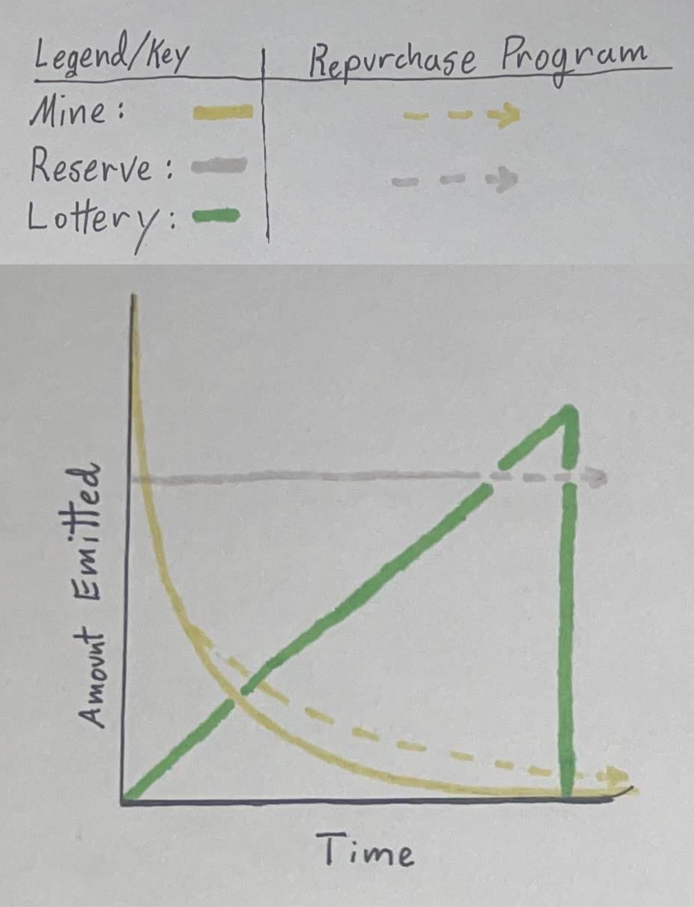

# 🪙 Tokens

The Realm of OGs features an extensive token ecosystem that drives the mechanics of the Realm, establishing relative values for different aspects of the ecosystem.&#x20;

## 6 Token Structure

Each of the 6 official tokens carries with it a unique purpose and works in conjunction with all other tokens.&#x20;

<table data-view="cards"><thead><tr><th></th><th></th><th data-type="content-ref"></th><th data-hidden data-card-cover data-type="files"></th></tr></thead><tbody><tr><td><h3>OG Realm ($OGR)</h3></td><td>The <strong>total power</strong> of the Realm</td><td><a href="usdogr-og-realm.md">usdogr-og-realm.md</a></td><td><a href="../../.gitbook/assets/Realms_Coins_Realm.png">Realms_Coins_Realm.png</a></td></tr><tr><td><h3>OG Matter ($OGM)</h3></td><td>The <strong>core elements</strong> of the Realm</td><td><a href="usdogm-og-matter.md">usdogm-og-matter.md</a></td><td><a href="../../.gitbook/assets/Realms_Coins_Matter.png">Realms_Coins_Matter.png</a></td></tr><tr><td><h3>OG Alchemy ($OGA)</h3></td><td>The <strong>dark science</strong> of the Realm</td><td><a href="usdoga-og-alchemy.md">usdoga-og-alchemy.md</a></td><td><a href="../../.gitbook/assets/Realms_Coins_Alchemy.png">Realms_Coins_Alchemy.png</a></td></tr><tr><td><h3>OG Gold ($OGG)</h3></td><td>The <strong>scarce reserves</strong> of the Realm</td><td><a href="usdogg-og-gold.md">usdogg-og-gold.md</a></td><td><a href="../../.gitbook/assets/Realms_Coins_Gold.png">Realms_Coins_Gold.png</a></td></tr><tr><td><h3>OG Coin ($OGC)</h3></td><td>The <strong>common value</strong> of the Realm</td><td><a href="usdogc-og-coin.md">usdogc-og-coin.md</a></td><td><a href="../../.gitbook/assets/Realms_Coins_Coin.png">Realms_Coins_Coin.png</a></td></tr><tr><td><h3>OG Fool ($OGF)</h3></td><td>The <strong>primal degeneracy</strong> of the Realm</td><td><a href="usdogf-og-fool.md">usdogf-og-fool.md</a></td><td><a href="../../.gitbook/assets/Realms_Coins_Fool.png">Realms_Coins_Fool.png</a></td></tr></tbody></table>


All of the value of the Realm is contained within these 6 tokens.


## Token Units

Max supply varies greatly between the the 6 Realm tokens:

<table><thead><tr><th width="98">Token</th><th width="218">Token Name</th><th width="83">Supply</th><th width="214" data-type="number">Supply</th><th data-type="number">Decimals</th></tr></thead><tbody><tr><td>OGR</td><td>OG Realm</td><td>1</td><td>1</td><td>9</td></tr><tr><td>OGM</td><td>OG Matter</td><td>1K</td><td>1000</td><td>9</td></tr><tr><td>OGA</td><td>OG Alchemy</td><td>1M</td><td>1000000</td><td>9</td></tr><tr><td>OGG</td><td>OG Gold</td><td>1B</td><td>1000000000</td><td>9</td></tr><tr><td>OGC</td><td>OG Coin</td><td>1T</td><td>1000000000000</td><td>7</td></tr><tr><td>OGF</td><td>OG Fool</td><td>1Q</td><td>1000000000000000</td><td>4</td></tr></tbody></table>

<figure><figcaption></figcaption></figure>

## Token Circulation

All 6 tokens are released into circulation on their own schedules in coordination with their relevent Institutions. This results in varying circulating supplies of each token relative to one another at any point in time.&#x20;

A deep understanding of the Token and Institution relationships is advised.

<figure><figcaption></figcaption></figure>

## Technical Information

To ensure safety for all players, the Solana mint addresses for each of the 6 Realm tokens are provided below.

<table><thead><tr><th width="111">Token</th><th width="519">Mint Address</th><th>Solscan</th></tr></thead><tbody><tr><td>$OGR</td><td>6BDG2QQvCaavLcK3HZ4218VeLY5E7YfBfDTTYortUad5</td><td><a href="https://solscan.io/token/6BDG2QQvCaavLcK3HZ4218VeLY5E7YfBfDTTYortUad5">Link</a></td></tr><tr><td>$OGM</td><td>F9og9QxJRmCh51gYBd27nhtvMgCR6mmotJu9Rcp9BEWn</td><td><a href="https://solscan.io/token/F9og9QxJRmCh51gYBd27nhtvMgCR6mmotJu9Rcp9BEWn">Link</a></td></tr><tr><td>$OGA</td><td>DyQqJJir6Y685wxECbPkmtveJjgxYcxyry1H2ToCb6vx</td><td><a href="https://solscan.io/token/DyQqJJir6Y685wxECbPkmtveJjgxYcxyry1H2ToCb6vx">Link</a></td></tr><tr><td>$OGG</td><td>5gJg5ci3T7Kn5DLW4AQButdacHJtvADp7jJfNsLbRc1k</td><td><a href="https://solscan.io/token/5gJg5ci3T7Kn5DLW4AQButdacHJtvADp7jJfNsLbRc1k">Link</a></td></tr><tr><td>$OGC</td><td>DH5JRsRyu3RJnxXYBiZUJcwQ9Fkb562ebwUsufpZhy45</td><td><a href="https://solscan.io/token/DH5JRsRyu3RJnxXYBiZUJcwQ9Fkb562ebwUsufpZhy45">Link</a></td></tr><tr><td>$OGF</td><td>EQyRaajDZLEEdSrU8Hws29LWjDJczGKB1CV6jrWcZJn9</td><td><a href="https://solscan.io/token/EQyRaajDZLEEdSrU8Hws29LWjDJczGKB1CV6jrWcZJn9">Link</a></td></tr></tbody></table>


Always verify details of the tokens that you are interacting with carefully.


Understanding this token structure is crucial as it ensures secure and informed interactions within the Realm ecosystem, allowing for transparency and authenticity of digital assets.&#x20;

Each token plays a distinct role in the Realm, and knowledge about their specifics helps OGs safeguard their transactions and make informed decisions.


During these early days of the Realm, it is prudent to understand that specific details about the unique purpose of each token will be revealed in time. OGs must learn to be comfortable with this slow revelation of purpose.

