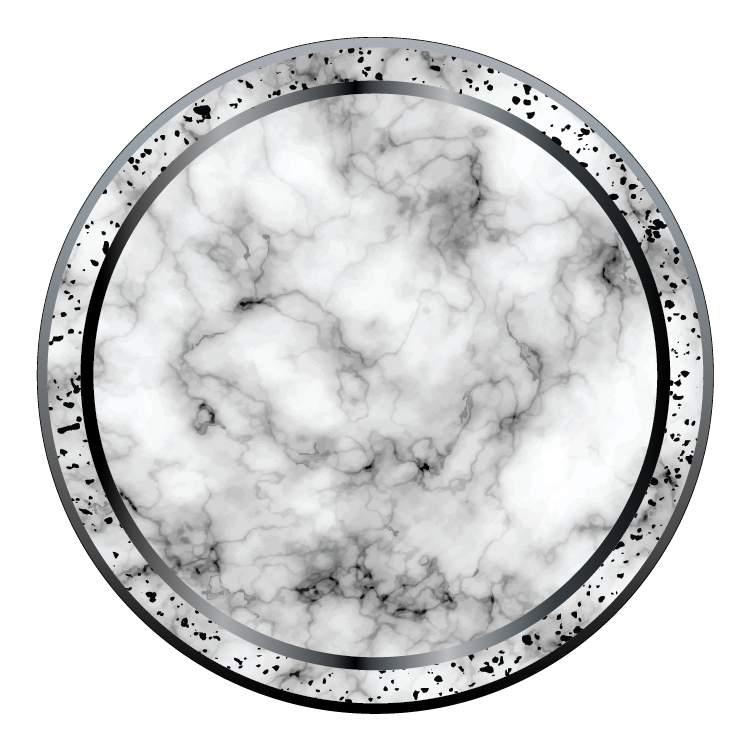

# $OGM - OG Matter

<figure><figcaption></figcaption></figure>

## Purpose

Established by Mad OG as a core element of the Realm, $OGM embodies the core building blocks of the Realm, supporting value distribution, liquidity connections, and structural integrations. It functions as matter-like essentials for ecosystem expansion, facilitating external bridges and foundational mechanics, with further details to be revealed over time.

## Tokenomics

### Supply and Distribution

* Total Supply: 1,000 (1K with 9 decimals).&#x20;
* Allocation: 10% to OG Bank for bonds; remainder coordinated with institutions.&#x20;
* Circulating Supply: Varies based on releases.

### Emissions Schedule

Pre-mined; no emissions specified.

### Mechanics

* Burns/Replenishments: Potential via unclaimed or repurchases.&#x20;
* Fees: Used in liquidity fees.&#x20;
* Interrelations: Bonds with $OGR and $OGA in Realm Pools; with cbBTC in Eternal Pools; SOL in Sanctioned.

## Institutions

* OG Bank: Manages bonds in pools.&#x20;
* Other: Supports external connections.

## Utility

* Supporting value distribution across institutions.
* Facilitating liquidity connections and external bridges (e.g., cbBTC pairs).
* Bonding with other tokens in Realm Pools for ecosystem integration.
* Potential for repurchases and burns to enhance scarcity.

## Liquidity Pools

Provide liquidity in $OGM pairs for fees. Swap SOL for $OGM to start.

| Pair       | Type       | Fee   | Meteora                                    |
| ---------- | ---------- | ----- | ------------------------------------------ |
| $OGM-$OGR  | Realm      | 0.25% | [Link](https://meteora.ag/pool/\[address]) |
| $OGM-$OGA  | Realm      | 0.25% | [Link](https://meteora.ag/pool/\[address]) |
| $OGM-cbBTC | Eternal    | 0.25% | [Link](https://meteora.ag/pool/\[address]) |
| $OGM-SOL   | Sanctioned | 0.25% | [Link](https://meteora.ag/pool/\[address]) |

## Technical Details

Mint Address: F9og9QxJRmCh51gYBd27nhtvMgCR6mmotJu9Rcp9BEWn ([Solscan](https://solscan.io/token/F9og9QxJRmCh51gYBd27nhtvMgCR6mmotJu9Rcp9BEWn))
