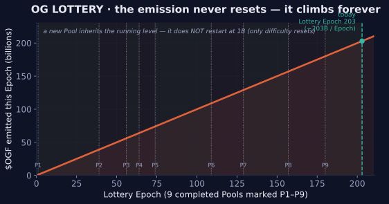

# 🎰 OG Lottery

## Established by OG Bank

[OG Bank](../power/og-bank.md) created OG Lottery to dispense [$OGF](../physics/tokens/ogf.md), the primal degeneracy of the Realm.

OG Lottery was created to be accessible to all OGs. It is the Realm's test of nerve — rewarding the early, the late, and the vigilant, each by a different blade.

## Initial Funding

OG Bank securely transferred nearly all of the remaining supply of $OGF — an endowment of **800T $OGF (80% of supply)** — to OG Lottery for distribution within the Realm, retaining 10% in the Bank's keeping. The transfers are [on the chain](../realm/timeline.md).

## The First Age and the Rebirth

The Lottery first opened its doors in September 2025 and ran its First Age. On **November 17, 2025**, it was rebooted with bug fixes onto its own sovereign program — and that program, born at **UEC 500**, is the canonical Lottery that runs today. Its entire history since rebirth is proven onchain: in the Creation Era it ran **9 pools and drew 869 bids**, distributing over **14.5T $OGF** to its winners.

*A note for astute prize-pool watchers: during the reset, the first post-reboot Epoch emitted 100,000 $OGF rather than the designed 1B. After the first post-reset pool was awarded on 12/22, this hiccup became immaterial to future pools.*

## How to Play

1. **Visit the Lottery**: [**lottery.ogrealm.xyz**](https://lottery.ogrealm.xyz/)
2. **Bid on the open Pool** — any number of times, each bid paying the fee set by the [Difficulty Curve](../physics/difficulty.md).
3. **The Pool grows.** Each Epoch, the Lottery releases a growing allotment of $OGF into the Pool — and the Pool stays open as long as the bids keep coming.
4. **The Final Bid wins.** A Pool closes only when **an entire Epoch passes without a single bid**. The last bid standing is the Final Bid.
5. **The split:** the OG holding the Final Bid receives **50% of the accumulated Pool**. All prior bids share the other 50%, proportional to each player's **number of bids** — including any earlier bids by the winner.
6. **Claim within 10 Epochs** — unclaimed winnings are **burned**.


Every other game in the Realm ends on the clock. The Lottery ends on silence. To win it outright, you must be the last voice before a full day of quiet — and the Realm is rarely quiet.


## The Numbers

### Emissions — the Accelerating Flood

OG Lottery emits a constantly increasing amount of $OGF each Epoch: **1B in its first Epoch, adding another 1B every Epoch after** — 1B, 2B, 3B, onward. More of the supply circulates as time goes on. Against its endowment, the flood runs approximately **1,265 Epochs (about 3.5 years)**.

A Pool's prize is the **sum of every Epoch's allotment it spanned** — long-lived Pools grow monstrous.

<figure><figcaption>OG Lottery — +1B $OGF more every Epoch; the longer a Pool lives, the heavier the prize</figcaption></figure>

### Difficulty

Lottery fees follow the Realm's one [difficulty law](../physics/difficulty.md): each new bidder pays a little more than the last — but unlike the Mine and Reserve, **the curve resets only upon a winning Final Bid**, so it climbs across multiple Epochs until a Pool closes. Early bids in a fresh Pool are nearly free; the late war is expensive by design.

## Replenishing — There Is No Replenishing

In stark contrast to the Mine and Reserve, repurchased $OGF is **burned**, not returned.

**Lottery fees:** collected fees are designated to buy $OGF back from the open market and burn it — reducing circulating supply. This arm of the [Repurchase Program](repurchase-programs.md) is ⚪ COMING.

**Unclaimed $OGF:** winnings unclaimed after 10 Epochs are burned, further reducing supply.

The Lottery does not refill. It consumes — and every burn makes the remaining Fool scarcer, and the [Degen class](../society/classes.md) smaller, forever.

## Mastery

Three ways to win, three temperaments:

* **Be early** — bids in a young Pool cost near nothing and hold a pro-rata claim on half of everything that follows
* **Be late** — the Final Bid takes half the Pool alone; but timing silence is the hardest read in the Realm
* **Be vigilant** — bid count, not bid size, sets your share; the persistent quietly compound their claim while the bold fight over the crown

In the Creation Era, a single player placed 551 of the Lottery's 869 bids and opened 7 of its 9 pools. The chain remembers what that discipline earned. The full timing game lives in [Paths of Play — Hard Mode](../paths/mode-5-arbitrageur.md).

## Status & Proof

| Item | Value |
| --- | --- |
| Game | [lottery.ogrealm.xyz](https://lottery.ogrealm.xyz/) |
| Program | `2CHDuw476jJk4oTtrKuA9PSvLsxSHsEQ3sLm3zJvwJsy` — [Solscan](https://solscan.io/account/2CHDuw476jJk4oTtrKuA9PSvLsxSHsEQ3sLm3zJvwJsy) |
| Born | Lottery Epoch 1 = UEC 500 (2025-11-16) |
| Epoch formula | Lottery Epoch = UEC − 499 |
| Creation Era record | 9 pools · 869 bids · 14.5T+ $OGF distributed |
| Repurchase | ⚪ COMING — [details](repurchase-programs.md) |

## Unlocking the Degen

$OGF represents the primal degeneracy of the Realm, with OG Lottery the Institution responsible for its distribution. Through OG Lottery, OGs attribute value to the Fool — and tap into the ecosystem of Luck and Fate that awaits them.

---

*✓ Verified by the Mad OG · UEC 702 (2026-06-06)*
