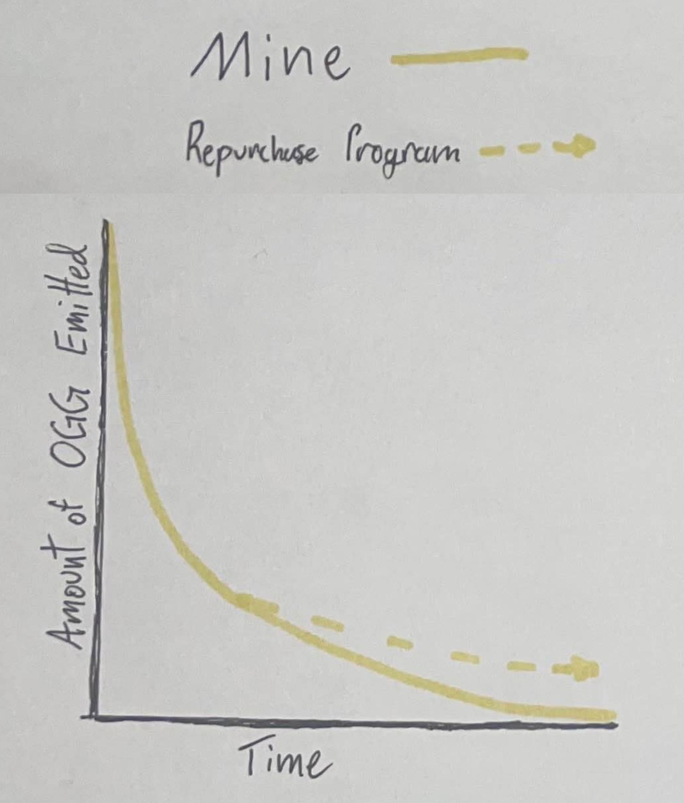

# 🛕 OG Mine

<figure><figcaption></figcaption></figure>

## Established by Mad OG

[Mad OG](../power/mad-og.md) established OG Mine as the giver of value in the Realm. Specifically, OG Mine oversees the flow of [$OGG](../physics/tokens/usdogg-og-gold.md) into the Realm.

OG Mine was created to be accessible to all OGs.

## Initial Funding

[OG Bank](../institutions/og-bank.md) securely transferred nearly all the remaining supply of [$OGG](../physics/tokens/usdogg-og-gold.md) to OG Mine (600m $OGG) for distribution within the Realm, except for 10% of $OGG, which OG Bank retained.

## Mine Operations

Understanding the OG Mine operation is critical to knowing how [$OGG](../physics/tokens/usdogg-og-gold.md) flows into the Realm as the source of all value.

### $OGG Emissions

OG Mine emits 1% of its remaining [$OGG](../physics/tokens/usdogg-og-gold.md) balance each epoch (24 hours), thus, the rate of $OGG emitted decreases continuously.&#x20;

However, there is no end date for OG Mine's emissions as the balance can never reach 0 $OGG.

<figure><figcaption></figcaption></figure>

### Mining $OGG

OGs can mine [$OGG](../physics/tokens/usdogg-og-gold.md) each epoch by visiting OG Mine:


[https://mine.ogrealm.xyz](https://mine.ogrealm.xyz/)


### Mining Fees

OGs can mine once per epoch by paying the mining fee in either SOL or [$OGC](../physics/tokens/usdogc-og-coin.md).

### Difficulty Curve

Mining fees (difficulty) increase with each new miner during an epoch. Mining difficulty is reset each epoch.

### Replenishing the Mine

#### Mining Fees

All collected mining fees are utilized by the [Repurchase Program](../constructs/repurchase-programs.md) to buy [$OGG](../physics/tokens/usdogg-og-gold.md) back from the open market. Repurchased $OGG is deposited back into OG Mine, ultimately functioning to replenish OG Mine.

#### Unclaimed $OGG

Additionally, [$OGG](../physics/tokens/usdogg-og-gold.md) mined but not claimed within 10 epochs is returned to OG Mine, further contributing to the replenishment function of OG Mine.

## A Gift from Mad OG

[$OGG](../physics/tokens/usdogg-og-gold.md) represents the scarce reserves of the Realm, ever decreasing over the Realm’s lifetime. Thus, OG Mine is a central function of the entire Realm, a gift from [Mad OG](../power/mad-og.md) from which the Realm’s value flows to OGs.
