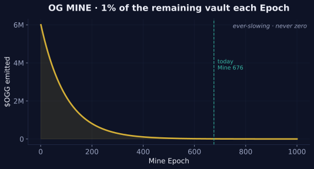

# 🛕 OG Mine

## Established by Mad OG

[Mad OG](../power/mad-og.md) established OG Mine as the giver of value in the Realm. Specifically, OG Mine oversees the flow of [$OGG](../physics/tokens/ogg.md) into the Realm — the scarce reserves from which all value descends.

OG Mine was created to be accessible to all OGs.

## Initial Funding

[OG Bank](../power/og-bank.md) securely transferred nearly all the remaining supply of $OGG to OG Mine — **600,000,000 $OGG (60% of supply)** — for distribution within the Realm, retaining 10% in the Bank's own keeping. The transfer is [on the chain](../realm/timeline.md).

## How to Play

1. **Visit the Mine** each Epoch: [**mine.ogrealm.xyz**](https://mine.ogrealm.xyz/)
2. **Pay the mining fee** — once per Epoch. The [difficulty curve](../physics/difficulty.md) means the earlier in the Epoch you mine, the less you pay; in an uncrowded Epoch, every miner pays pennies.
3. **Receive your share** of the Epoch's $OGG emission.
4. **Claim within 10 Epochs.** Mined $OGG left unclaimed returns to the Mine.


Mining rewards consistency above all. The longest streaks in the Realm have not missed an Epoch in hundreds of days — and the chain remembers every one.


## The Numbers

### Emissions — the 1% Law

OG Mine emits **1% of its remaining $OGG balance each Epoch**. The rate of $OGG emitted therefore decreases continuously — each Epoch's emission is 99% of the last — yet there is **no end date**: the balance can never reach zero.

This is geometric decay: an eternal spring that flows forever, and forever more slowly. Every Epoch you wait, the Mine gives less. The cheapest Gold ever emitted was emitted yesterday.

The live per-Epoch emission figure is on the [Onchain Status](../canon/onchain-status.md) page.

<figure><figcaption>OG Mine — 1% of the remaining vault each Epoch; ever-slowing, never zero</figcaption></figure>

### Difficulty

Mining fees follow the Realm's one [difficulty law](../physics/difficulty.md): each new miner in an Epoch pays a little more than the last, and the curve resets every Epoch at 00:00 UTC. The early miners of an Epoch pay only a fraction of a SOL; only a true crowd pays dearly.

### Fee Token

Fees are paid in SOL. The $OGC fee path was introduced 02/03/25 and is currently **UNDER REPAIR** — live status on the [Onchain Status](../canon/onchain-status.md) page.

## Replenishing the Mine

**Mining fees:** all collected fees are utilized by the [Repurchase Program](repurchase-programs.md) to buy $OGG back from the open market. Repurchased $OGG is deposited back into OG Mine — the Mine feeds itself from the appetite of its miners.

**Unclaimed $OGG:** Gold mined but not claimed within 10 Epochs is returned to OG Mine, further contributing to its replenishment.

## Mastery

The Mine looks simple. It is not finished with you:

* **The streak game** — consistency compounds; the decay law means every missed Epoch is Gold you can never mine at that price again
* **The fee window** — mining early in the Epoch is structurally discounted; the difference between first and fiftieth is 2,500×
* **Gold's three lives** — mined Gold can be held (toward [Capital 💰](../society/classes.md)), locked (into the [Reserve](og-reserve.md) for $OGC yield — at the price of its Class weight), or bonded (one third of the [Knight's vow](../society/knighthood.md))

The full strategy layer lives in [Paths of Play](../paths/README.md).

## Status & Proof

| Item | Value |
| --- | --- |
| Game | [mine.ogrealm.xyz](https://mine.ogrealm.xyz/) |
| Program | `97PknNK44vrCKs88WpEXQwDqhRFS4SZwVVWyo2BjFstn` — [Solscan](https://solscan.io/account/97PknNK44vrCKs88WpEXQwDqhRFS4SZwVVWyo2BjFstn) |
| Born | Mine Epoch 1 = UEC 26 (2024-07-30) |
| Epoch formula | Mine Epoch = UEC − 25 |
| Repurchase | 🟢 ACTIVE — [details](repurchase-programs.md) |

## A Gift from Mad OG

$OGG represents the scarce reserves of the Realm, ever decreasing over the Realm's lifetime. Thus, OG Mine is a central function of the entire Realm — a gift from Mad OG from which the Realm's value flows to OGs.

---

*✓ Verified by the Mad OG · UEC 702 (2026-06-06)*
