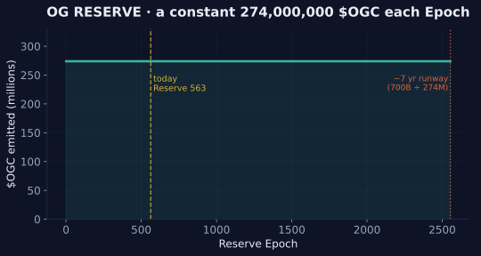

# 🏛️ OG Reserve

## Established by OG Bank

[OG Bank](../power/og-bank.md) created OG Reserve to allow for the emergence of [$OGC](../physics/tokens/ogc.md), the common value of the Realm.

OG Reserve was created to be accessible to all OGs — although ownership of some portion of [$OGG](../physics/tokens/ogg.md) is required to participate. The Reserve is where Gold goes to work.

## Initial Funding

OG Bank securely transferred all of the remaining supply of $OGC — **700,000,000,000 (70% of supply)** — to OG Reserve for distribution within the Realm. The transfer is [on the chain](../realm/timeline.md).

## How to Play

1. **Lock $OGG** — any amount, for **100 Epochs**, at [**reserve.ogrealm.xyz**](https://reserve.ogrealm.xyz/). There are no locking fees. After 100 Epochs, unlocking becomes available — or leave it locked and keep playing.
2. **Allocate every Epoch.** Each Epoch, return and allocate your locked $OGG across any of the 4 **Reserve Slots** — Alpha, Beta, Gamma, Delta. Up to 100% of your locked Gold, across one or more slots. **This is an active choice made fresh each Epoch, not a standing position.**
3. **Pay the reserve fee** per allocation, per the [Difficulty Curve](../physics/difficulty.md) — and reserve as many times per Epoch as you have unallocated locked $OGG.
4. **The second-largest slot wins.** At Epoch's end, the slot holding the **2nd largest** amount of allocated $OGG distributes the entire Epoch reward — **274,000,000 $OGC** — to its allocators, proportional to each one's contribution.
5. **Claim within 10 Epochs.** Unclaimed $OGC returns to the Reserve.


Read step 4 again. Not the largest slot. The **second** largest. The Reserve does not reward the herd — it rewards those who can read where the herd will go, and stand one step aside.


## The Numbers

### Emissions — the Constant River

OG Reserve emits **274,000,000 $OGC every Epoch** — constant, unvarying. From its 700B endowment, the river runs for roughly **2,554 Epochs (about 7 years)** with no replenishment — and the [Repurchase Program](repurchase-programs.md) exists to extend that tail.

<figure><figcaption>OG Reserve — a constant 274M $OGC each Epoch, a ~7-year runway</figcaption></figure>

### The Lock

The 100-Epoch lock is the Reserve's covenant: Gold committed is Gold proven. Locked $OGG **does not count toward your Class** — commitment and standing are a visible trade, and the Realm watches who chooses which.

### Difficulty

Reserve fees follow the Realm's one [difficulty law](../physics/difficulty.md): each new reserver in the Epoch pays a little more than the last, resetting every Epoch at 00:00 UTC — early reservers pay the least. Fee token status: SOL live; $OGC path **UNDER REPAIR** — see [Onchain Status](../canon/onchain-status.md).

## Replenishing the Reserve

**Reserve fees:** the [Repurchase Program](repurchase-programs.md) utilizes collected fees to buy $OGC back from the open market and deposit it into OG Reserve, extending the river's life.

**Unclaimed $OGC:** rewards left unclaimed for 10 Epochs return to the Reserve.

## Mastery

The Reserve is the Realm's purest game of minds:

* **Slot selection is the skill** — every Epoch is a fresh four-way standoff; the prize goes to second place, so the obvious play is never the winning one
* **Timing is power** — allocations made late in the Epoch see more of the board; allocations made early pay smaller fees. Choose your blindness.
* **Scale changes the game** — small reservers can spread across slots; large reservers can *move* the rankings by where they land. When giants allocate, the board itself tilts.
* **The defensive spread** — allocating evenly across all four slots guarantees a share of second place; it also guarantees you'll never beat those who guessed.

The full game theory lives in [Paths of Play — Hard Mode](../paths/mode-5-arbitrageur.md).

## Status & Proof

| Item | Value |
| --- | --- |
| Game | [reserve.ogrealm.xyz](https://reserve.ogrealm.xyz/) |
| Program | `D3FxBBz3Kdf43AkCBZz6kSnkfjRrhGYPxFkUgjnV41Ch` — [Solscan](https://solscan.io/account/D3FxBBz3Kdf43AkCBZz6kSnkfjRrhGYPxFkUgjnV41Ch) |
| Born | Reserve Epoch 1 = UEC 139 (2024-11-20) |
| Epoch formula | Reserve Epoch = UEC − 138 |
| Repurchase | 🟠 UNDER REPAIR — [details](repurchase-programs.md) |

## OGs Secure the Realm

$OGC represents the common value of the Realm, making OG Reserve a critical OG-powered Institution. OG Reserve awards those who secure the value of the Realm ($OGG) with a continuous flow of $OGC as the Realm grows in power.

Unlike an outer-world institution like the Federal Reserve, OG Reserve — comprised of $OGG and $OGC — is controlled entirely by OGs, without permission or regulation.

---

*✓ Verified by the Mad OG · UEC 702 (2026-06-06)*
