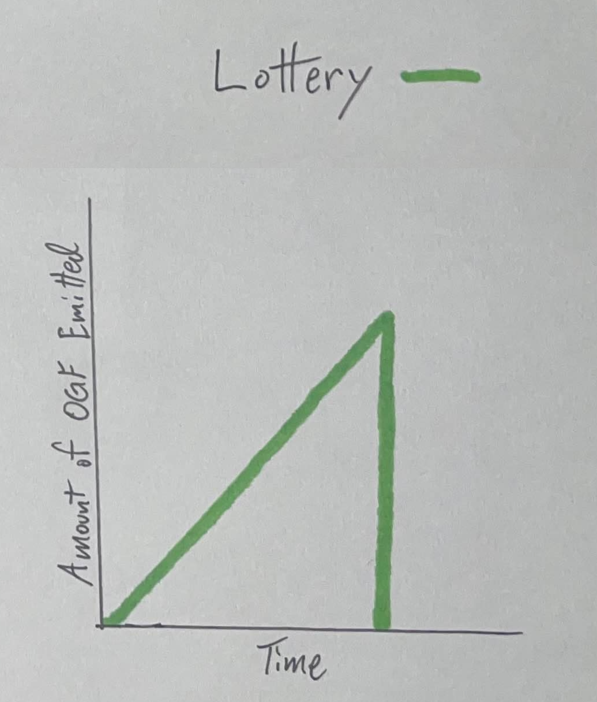

# 🎰 OG Lottery

<figure><figcaption></figcaption></figure>

## Established by OG Bank

[OG Bank](og-bank.md) created OG Lottery to dispense [$OGF](../constructs/tokens/usdogf-og-fool.md), the primal degeneracy of the Realm.

OG Lottery was created to be accessible to all OGs.

## Initial Funding

[OG Bank](og-bank.md) securely transferred nearly all of the remaining supply of [$OGF](../constructs/tokens/usdogf-og-fool.md) to OG Lottery (800T $OGF) for distribution within the Realm, except for 10% of $OGF, which OG Bank retained.

## Lottery Operations

While notable differences exist, OG Lottery functions similarly to [OG Mine](og-mine.md) and [OG Reserve](og-reserve.md). Specifically, OG Lottery dispenses [$OGF](../constructs/tokens/usdogf-og-fool.md).

### $OGF Emissions

OG Lottery emits a constantly increasing amount of [$OGF](../constructs/tokens/usdogf-og-fool.md) each epoch, beginning at 1b (1,000,000,000)  $OGF per Epoch and adding 1b (1,000,000,000) $OGF each subsequent epoch. Since the amount of $OGF emitted increases at a constant rate, more of the supply continues to circulate as time goes on. Based on this emissions schedule, OG Lottery will continue to emit $OGF for approximately 1,265 epochs (or 3.5 years), considering the total supply of $OGF initially sent to OG Lottery for distribution.

<figure><figcaption></figcaption></figure>

### Bidding $OGF

OGs can bid for $OGF each epoch by visiting OG Lottery:


[https://lottery.ogrealm.xyz](https://lottery.ogrealm.xyz/)


### Lottery Fees

OGs can bid any number of times each epoch by paying the Lottery fee, paid in either SOL or [$OGC](../constructs/tokens/usdogc-og-coin.md).

### Lottery Winners

The Final Bid is considered the winner of each Lottery Pool. Unlike both [OG Mine](og-mine.md) and[ OG Reserve](og-reserve.md), winners of OG Lottery are not necessarily determined each epoch. Instead, the Final Bid is determined when an entire epoch passes with no subsequent bid. The OG with the Final Bid receives 50% of the accumulated [$OGF](../constructs/tokens/usdogf-og-fool.md) in the Lottery Pool, while all prior bids share 50% of the Lottery Pool, proportional to each player's number of bids.&#x20;

### Difficulty Curve

Lottery fees (difficulty) increase with each new bidder. Unlike both [OG Mine](og-mine.md) and [OG Reserve](og-reserve.md) (in which difficulty resets each epoch), OG Lottery difficulty is reset only upon each successful winning Final Bid. Therefore, the difficulty curve continues to increase over multiple epochs (or until a Final Bid is confirmed).

### ~~Replenishing the Lottery~~

The Repurchase Program utilizes all collected reserve fees to buy [$OGF](../constructs/tokens/usdogf-og-fool.md) back from the open market. However, in stark contrast to both [OG Mine](og-mine.md) and [OG Reserve](og-reserve.md), $OGF repurchased is burned. This reduces the supply of $OGF and does NOT function to replenish the OG Lottery.

#### Lottery Fees

All lottery fees collected are used to buy [$OGF](../constructs/tokens/usdogf-og-fool.md) back from the open market to be burned, ultimately functioning to reduce the circulating supply of $OGF.

#### Unclaimed $OGF

Additionally, [$OGF](../constructs/tokens/usdogf-og-fool.md) won but not claimed within 10 epochs is burned, further contributing to the reduction function of $OGF.

## Unlocking the Degen

[$OGF](../constructs/tokens/usdogf-og-fool.md) represents the primal degeneracy of the Realm, with OG Lottery being the institution responsible for its distribution. OG Lottery rewards those for being both early (low difficulty, guaranteed prize) and late (winner takes the lion's share).

Through OG Lottery, OGs have the ability to attribute value to $OGF in order to tap into the ecosystem of Luck and Fate that awaits them.
