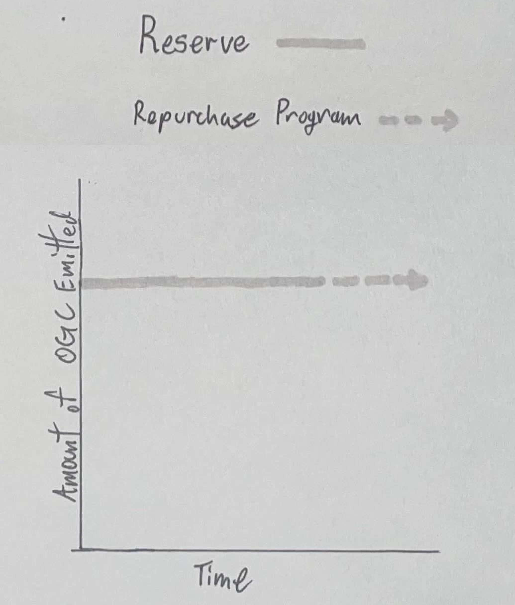
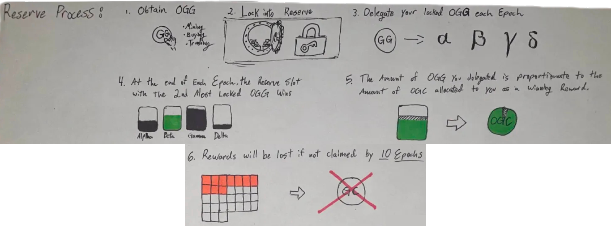

# 🏛️ OG Reserve

## Established by OG Bank

[OG Bank](og-bank.md) created OG Reserve to allow for the emergence of [$OGC](../constructs/tokens/usdogc-og-coin.md), the common value of the Realm.

OG Reserve was created to be accessible to all OGs, although ownership of some portion of [$OGG](../constructs/tokens/usdogg-og-gold.md) is required to participate.

## Initial Funding

[OG Bank](og-bank.md) securely transferred all of the remaining supply of [$OGC](../constructs/tokens/usdogc-og-coin.md) (70%) to OG Reserve for distribution within the Realm.

## Reserve Operations

Mirroring many basic elements of [OG Mine](og-mine.md), OG Reserve functions similarly, in this case, to distribute [$OGC](../constructs/tokens/usdogc-og-coin.md).

### $OGC Emissions

OG Reserve emits 274m (274,000,000) [$OGC](../constructs/tokens/usdogc-og-coin.md) each Epoch, thus the rate of $OGC emitted remains constant. There is no end date for OG Reserve's emissions; though theoretically, the end would calculate to 10,000 epochs (or 7 years), considering the total supply of $OGC initially sent to OG Reserve for distribution with no replenishment.

<figure><figcaption></figcaption></figure>

### Reserving $OGG

OGs can earn [$OGC](../constructs/tokens/usdogc-og-coin.md) each epoch by visiting OG Reserve:


[https://reserve.ogrealm.xyz](https://reserve.ogrealm.xyz/)


To participate in OG Reserve, OGs must lock [$OGG](../constructs/tokens/usdogg-og-gold.md) in any amount in OG Reserve for 100 epochs. There are no locking fees.

<figure><figcaption></figcaption></figure>

### Allocating $OGG

During the 100-epoch locked timeframe (and for any number of epochs after this initial lock where an OG chooses not to unlock their [$OGG](../constructs/tokens/usdogg-og-gold.md)), OGs can return to OG Reserve each epoch to allocate their locked $OGG to any of 4 Reserve Slots:

* Alpha
* Beta
* Gamma
* Delta

OGs can utilize up to 100% of their locked $OGG in any allocation across a minimum of 1 Reserve Slot.

### Reserve Fees

OGs can reserve any number of times each epoch by paying the reserve fee, paid in either SOL or [$OGC](../constructs/tokens/usdogc-og-coin.md), as long as they have unallocated locked [$OGG](../constructs/tokens/usdogg-og-gold.md). Additional $OGG can be locked in OG Reserve at any time to allocate additional $OGG to the Reserve Slots.

### Winning Reserve Slot

At the end of each epoch, the Reserve Slot with the 2nd largest amount of locked [$OGG](../constructs/tokens/usdogg-og-gold.md) is chosen. This slot distributes the entire epoch reward (274m [$OGC](../constructs/tokens/usdogc-og-coin.md)) to reservers who allocated locked $OGG to it. Each reserver’s reward is based on the proportion of their locked $OGG contributed to that slot during the epoch.

### Difficulty Curve

During an epoch, reserve fees increase with each new reserver (reserve difficulty). Reserve difficulty is reset each epoch.

### Replenishing the Reserve

#### Reserve Fees

The [Repurchase Program](../constructs/repurchase-program.md) utilizes all collected reserve fees to buy [$OGC](../constructs/tokens/usdogc-og-coin.md) back from the open market and deposit it back into OG Reserve, ultimately functioning to replenish the OG Reserve.

#### Unclaimed $OGC

[$OGC](../constructs/tokens/usdogc-og-coin.md) earned but not claimed by an OG within 10 epochs is also returned to OG Reserve, further contributing to the replenishment function of OG Reserve.

<figure><figcaption></figcaption></figure>

## OGs Secure the Realm

[$OGC](../constructs/tokens/usdogc-og-coin.md) represents the common value of the Realm, thus making OG Reserve a critical OG-powered institution of the Realm. OG Reserve awards those OGs who secure the value of the Realm ([$OGG](../constructs/tokens/usdogg-og-gold.md)) with a continuous flow of $OGC as the Realm grows in power.

Unlike an outer world institution like the Federal Reserve, OG Reserve, comprised of $OGG and $OGC, is controlled entirely by OGs without permission or regulation.
