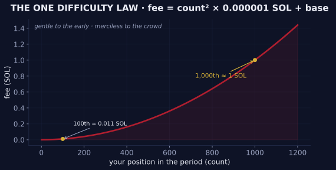

# 📈 Difficulty

## Proof of Work

The concept of Difficulty is derived from traditional applications of Proof-of-Work.

Early during any process, minimal inputs are required to complete a particular task. As participation increases, so does the difficulty — the required amount of total input. The effect rewards the early and taxes the late.

## The One Law

Every Game of the Realm obeys the same difficulty curve, applied to its fees. [OG Mine](../games/og-mine.md), [OG Reserve](../games/og-reserve.md), and [OG Lottery](../games/og-lottery.md) all charge a fee to play, and that fee rises with each new player in the period. Said simply: **the earlier you act, the less you pay — and a crowd pays dearly.**

This page is the technical home of that law. Everywhere else in this book the curve is described in plain words; here is the exact formula.


**Fee = (count)² × 0.000001 SOL + base**

where `count` is your position in the period and `base` is a small per-Game fixed fee.


The fee grows with the **square** of the count — exponentially, not linearly — which is what makes early participation so heavily favored. A small fixed base sits beneath the curve so that even the very first player pays a modest fee.

### The base fees (per Game)

| Game | Base fee | Difficulty term | Status |
| --- | --- | --- | --- |
| 🛕 OG Mine | 0.001225 SOL | (count)² × 0.000001 SOL | 🟢 proven |
| 🏛️ OG Reserve | ≈ 0.001448 SOL | (count)² × 0.000001 SOL | 🟢 proven |
| 🎰 OG Lottery | pending decode | (count)² × 0.000001 SOL | 🟡 same law presumed |

Live base values are carried on the [Onchain Status](../canon/onchain-status.md) page.


**Proven onchain.** Across 24,264 player fee transactions in the Mine's full history, 91.8% fit this formula exactly to within 2 microSOL — successive fees climbing by consecutive odd microSOL, the unmistakable signature of a pure quadratic. The Reserve obeys the identical term. (An earlier published figure of `0.005 × count²` was a documentation error, refuted by the chain and corrected here.)


## The Cost of Lateness

Using the Mine's base, here is what each player pays:

| You are player… | Your fee (≈) |
| --- | --- |
| 1st | ~0.0012 SOL |
| 10th | ~0.0013 SOL |
| 100th | ~0.011 SOL |
| **1,000th** | **~1 SOL** |
| 10,000th | ~100 SOL |

The curve is gentle to the early and merciless to the crowd: the first hundred players of any period pay pennies, the thousandth pays about a full SOL, and the ten-thousandth pays a hundred. In the Realm, punctuality is not a virtue — it is a strategy.

<figure><figcaption>The one difficulty law — gentle to the early, merciless to the crowd</figcaption></figure>

## Reset Rules

When the curve resets differs by Game — and the difference is itself a mechanic:

| Game | Difficulty resets… |
| --- | --- |
| 🛕 OG Mine | every Epoch (00:00 UTC) |
| 🏛️ OG Reserve | every Epoch (00:00 UTC) |
| 🎰 OG Lottery | **only upon a winning Final Bid** — the curve climbs across Epochs until a Pool closes |

The Lottery's unresetting curve is what makes its late game expensive, its early game cheap, and its timing a discipline of its own. Those who learn to read the curve learn to read the Realm.

---

*✓ Verified by the Mad OG · UEC 702 (2026-06-06)*
