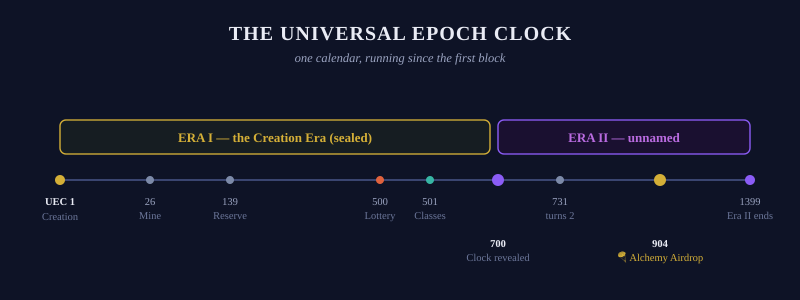

# ☀️ Epochs

## Units of Time

The entire Realm of OGs operates on a distinct time clock: **Epochs**.

Each Epoch lasts for a total of 24 hours and resets at **00:00 UTC**.

## Institution Cycles

All Institutions responsible for token emissions — [OG Mine](../games/og-mine.md), [OG Reserve](../games/og-reserve.md), and [OG Lottery](../games/og-lottery.md) — operate cyclically by the Epoch mechanism.

At the turn of each Epoch, token emissions, rewards, and claims are processed based on the previous 24-hour activity.

## The Universal Epoch

Time in the Realm of OGs is measured from a single, sovereign point of origin: **the day the six Realm tokens were struck**.

On UEC Epoch 1 — **July 5, 2024** — the Mad OG minted all six Realm tokens from `ogrealm.sol`, bringing the Realm into existence on Solana. Every Epoch that has passed since that day is recorded in the **Universal Epoch Clock** (UEC) — the Realm's official, immutable calendar.

> *"It is not the Mine's clock. It is not the Reserve's clock. It is the Realm's clock — and it has been running since the first block was written."*

The Universal Epoch is computed as the number of 24-hour cycles elapsed since Creation:

```
Universal Epoch = days elapsed since 2024-07-05 + 1
```

## Institutional Epochs

Each Institution maintains its own Epoch counter, representing the age of that Institution. These counters run in parallel with — and are anchored within — the Universal Epoch.

| Institution | Born | UEC at Birth | Formula |
| --- | --- | --- | --- |
| 🛕 OG Mine | 2024-07-30 | UEC 26 | Mine Epoch = UEC − 25 |
| 🏛️ OG Reserve | 2024-11-20 | UEC 139 | Reserve Epoch = UEC − 138 |
| 🎰 OG Lottery | 2025-11-16 | UEC 500 | Lottery Epoch = UEC − 499 |

Institutional Epochs continue to be displayed on their respective platforms. The Universal Epoch is the unifying layer above them — the answer to the question: *"How old is the Realm?"*

## Eras

Epochs are gathered into **Eras of 700**. A new era begins at every UEC multiple of 700.

* **Era I — the Creation Era — UEC 1 through 699** (2024-07-05 → 2026-06-03). The founding age: the tokens struck, the Institutions raised, the first OGs proven. **Sealed.**
* **Era II — UEC 700 through 1399** (2026-06-04 → 2028-05-03). Deliberately unnamed — *"Epoch 700 begins the next."* The current era.
* Era III begins at UEC 1400.


Eras are not Realm Years. Realm Years are solar and ordinal from Creation — Year 1 spans UEC 1–365; at each July 5 the Realm turns a year older (UEC 731: **the Realm turns 2; its third year begins**). Eras are the Realm's sovereign 700-Epoch periods. Never conflate the two.


<figure><figcaption>The Universal Epoch Clock — Era I sealed, Era II underway</figcaption></figure>

## Key Epochs in Realm History

| Universal Epoch | Date | Event |
| --- | --- | --- |
| **1** | 2024-07-05 | 🔱 Creation — Six Tokens Minted |
| **2** | 2024-07-06 | 🏦 OG Bank & 🕋 OG Lab Established |
| **3** | 2024-07-07 | 🏰 Realm Pools Seeded |
| **26** | 2024-07-30 | 🛕 OG Mine Opens — Mine Epoch 1 |
| **139** | 2024-11-20 | 🏛️ OG Reserve Opens — Reserve Epoch 1 |
| **500** | 2025-11-16 | 🎰 OG Lottery Reborn — Lottery Epoch 1 |
| **501** | 2025-11-17 | 👤 The Classes Announced |
| **699** | 2026-06-03 | The Creation Era closes |
| **700** | 2026-06-04 | ☀️ Universal Epoch Clock Activated — Era II begins |
| **731** | 2026-07-05 | The Realm turns 2 — Year 3 begins |
| **904** | 2026-12-25 | 🪂 The Alchemy Airdrop |

## Reading the Universal Epoch

When an OG mines, locks, or bids, they do so within a specific Universal Epoch. This number is permanent. It cannot be reset, adjusted, or manipulated. It is the onchain timestamp of the Realm, expressed in human-readable time.

An OG who mined on UEC Epoch 26 was present at the very first emission. An OG who joins today is born in Era II. **The Universal Epoch is your position in Realm history — wear it accordingly.**

---

*✓ Verified by the Mad OG · UEC 702 (2026-06-06)*
