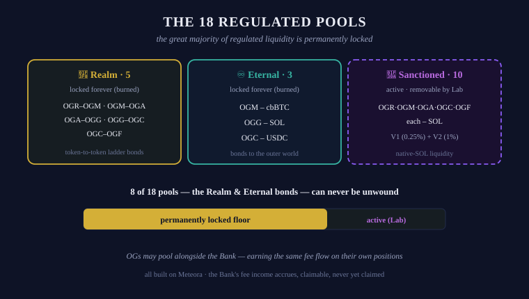

# Liquidity Pools

## Protocol Liquidity

To support the Realm's vast and extensive 6-[token](tokens.md) structure, [OG Bank](../power/og-bank.md) and [OG Lab](../power/og-lab.md) have established several key Liquidity Pools for the Realm.

The Realm's structured network of Regulated Pools operates as a dynamic engine, balancing the tokens with each other and outer-world assets.


Liquidity Pools are a key component to the functioning of Realm tokens across the Realm ecosystem.


## Regulated Pools

The Institutions of the Realm host a structured framework of **18 Regulated Pools** across 3 types, ensuring the proper environment exists for the Realm to be both liquid and scarce:

| Type | Count | Nature | Steward |
| --- | --- | --- | --- |
| 🏰 [Realm Pools](liquidity-pools/realm-pools.md) | 5 | All 6 tokens permanently bonded to each other — **locked forever** | OG Bank |
| ♾️ [Eternal Pools](liquidity-pools/eternal-pools.md) | 3 | 3 tokens permanently bonded to outer-world assets — **locked forever** | OG Bank |
| 🌊 [Sanctioned Pools](liquidity-pools/sanctioned-pools.md) | 10 (V1 + V2) | 5 tokens liquidity-boosted to native SOL — **active, removable** | OG Lab |


All Regulated Pools are built on Meteora on Solana. All carry a 0.25% fee rate, with the exception of V2 Sanctioned Pools at 1%.


**The great majority of the Realm's regulated liquidity is permanently locked.** The Bank burned its LP tokens — the Realm and Eternal bonds can never be unwound, by anyone, ever. This permanence is the floor on which everything else stands. Live figures: [Onchain Status](../canon/onchain-status.md).

<figure><figcaption>The 18 Regulated Pools — 8 permanently locked, 10 active</figcaption></figure>

## OG Participation

OGs are heavily encouraged to participate in providing liquidity with their Realm tokens. The Bank's bonded **principal** is locked forever — but its **fee income is not**: fees accrue to OG Bank and are claimable at any time. To this day the Bank has never claimed them; they are its primary source of income, and the Realm expects the Bank to draw upon them in some way, at some time of its choosing. **OGs who pool alongside the Bank's permanent liquidity earn that same fee flow on their own positions**, atop a foundation that can never be pulled out from under them — and unlike the Bank's burned bonds, an OG's own position remains withdrawable.

OGs are also encouraged to set up their own pools outside the Regulated framework. Unique pairs with Realm tokens support the growth of the Realm — as does any pool offering better, more competitive rates.


Individual links to participate in every Regulated Pool can be found on the three pages that follow.


---

*✓ Verified by the Mad OG · UEC 702 (2026-06-06)*
