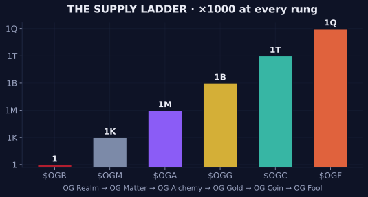

# 🪙 Tokens

The Realm of OGs features an extensive token ecosystem that drives the mechanics of the Realm, establishing relative values for different aspects of the ecosystem.

## The Six-Token Ladder

Each of the 6 official tokens carries a unique purpose and works in conjunction with all other tokens. Their supplies ascend a thousandfold at every rung — one supply ladder, six forms of value:

| Token | Name | Essence | Supply | Decimals |
| --- | --- | --- | --- | --- |
| [$OGR](tokens/ogr.md) | OG Realm | The **total power** of the Realm | **1** | 9 |
| [$OGM](tokens/ogm.md) | OG Matter | The **core elements** of the Realm | **1K** | 9 |
| [$OGA](tokens/oga.md) | OG Alchemy | The **dark science** of the Realm | **1M** | 9 |
| [$OGG](tokens/ogg.md) | OG Gold | The **scarce reserves** of the Realm | **1B** | 9 |
| [$OGC](tokens/ogc.md) | OG Coin | The **common value** of the Realm | **1T** | 7 |
| [$OGF](tokens/ogf.md) | OG Fool | The **primal degeneracy** of the Realm | **1Q** | 4 |


All of the value of the Realm is contained within these 6 tokens.


<figure><figcaption>The Supply Ladder — ×1000 at every rung, six tokens</figcaption></figure>

## Token Circulation

All 6 tokens are released into circulation on their own schedules in coordination with their relevant Institutions: $OGG flows from the [Mine](../games/og-mine.md), $OGC from the [Reserve](../games/og-reserve.md), $OGF from the [Lottery](../games/og-lottery.md) — while $OGR, $OGM, and $OGA rest almost entirely in the keeping of [the Crown](../power/mad-og.md). This results in varying circulating supplies of each token relative to one another at any point in time.

A deep understanding of the Token and Institution relationships is advised. Each emitting token also guards a [Class](../society/classes.md) of the Realm — supply and society are one system.

## Technical Information

To ensure safety for all players, the Solana mint addresses for each of the 6 Realm tokens are provided below.

| Token | Mint Address | Solscan |
| --- | --- | --- |
| $OGR | `6BDG2QQvCaavLcK3HZ4218VeLY5E7YfBfDTTYortUad5` | [Link](https://solscan.io/token/6BDG2QQvCaavLcK3HZ4218VeLY5E7YfBfDTTYortUad5) |
| $OGM | `F9og9QxJRmCh51gYBd27nhtvMgCR6mmotJu9Rcp9BEWn` | [Link](https://solscan.io/token/F9og9QxJRmCh51gYBd27nhtvMgCR6mmotJu9Rcp9BEWn) |
| $OGA | `DyQqJJir6Y685wxECbPkmtveJjgxYcxyry1H2ToCb6vx` | [Link](https://solscan.io/token/DyQqJJir6Y685wxECbPkmtveJjgxYcxyry1H2ToCb6vx) |
| $OGG | `5gJg5ci3T7Kn5DLW4AQButdacHJtvADp7jJfNsLbRc1k` | [Link](https://solscan.io/token/5gJg5ci3T7Kn5DLW4AQButdacHJtvADp7jJfNsLbRc1k) |
| $OGC | `DH5JRsRyu3RJnxXYBiZUJcwQ9Fkb562ebwUsufpZhy45` | [Link](https://solscan.io/token/DH5JRsRyu3RJnxXYBiZUJcwQ9Fkb562ebwUsufpZhy45) |
| $OGF | `EQyRaajDZLEEdSrU8Hws29LWjDJczGKB1CV6jrWcZJn9` | [Link](https://solscan.io/token/EQyRaajDZLEEdSrU8Hws29LWjDJczGKB1CV6jrWcZJn9) |

All six were minted from `ogrealm.sol` on July 5, 2024 — UEC Epoch 1 — in a single twelve-minute window. Mint and freeze authorities are null on all six: **the supplies are sealed forever, and no account can ever be frozen.**


Always verify details of the tokens that you are interacting with carefully. The full address canon lives in the [Verified Registry](../canon/verified-registry.md).



During these early days of the Realm, it is prudent to understand that specific details about the unique purpose of each token will be revealed in time. OGs must learn to be comfortable with this slow revelation of purpose.


---

*✓ Verified by the Mad OG · UEC 702 (2026-06-06)*
