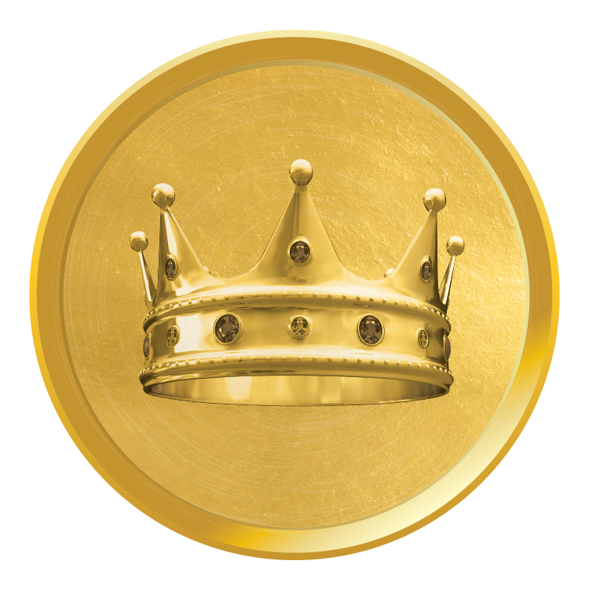

# 🟡 $OGG — OG Gold

<figure><figcaption>The official $OGG token — verify the mint in the <a href="../../canon/verified-registry.md">Verified Registry</a></figcaption></figure>

## Purpose

$OGG is the scarce reserves of the Realm — its gold. One billion units, of which 60% was entrusted to a single duty: the [OG Mine](../../games/og-mine.md), which emits 1% of its remaining balance every Epoch, forever — a flow that grows scarcer with every passing day and never reaches zero.

Gold is the working capital of the serious player: mined daily, locked into the [Reserve](../../games/og-reserve.md) for yield, and bonded into the Knight's vow.

## Physics

| Property | Value |
| --- | --- |
| Name | OG Gold |
| Supply | **1,000,000,000** (sealed forever) |
| Decimals | 9 |
| Mint | `5gJg5ci3T7Kn5DLW4AQButdacHJtvADp7jJfNsLbRc1k` — [Solscan](https://solscan.io/token/5gJg5ci3T7Kn5DLW4AQButdacHJtvADp7jJfNsLbRc1k) |
| Struck | UEC 1 — 2024-07-05, from `ogrealm.sol` |

## In Motion

* **Emitted** by the 🛕 Mine: 1% of remaining vault per Epoch — ever-decreasing, never-ending
* **Locked** in the 🏛️ Reserve: players bind $OGG for 100 Epochs to farm $OGC — locked Gold is committed Gold, and it does not count toward Class
* **Bonded:** 20% locked forever in [Realm Pools](../liquidity-pools/realm-pools.md), 10% bonded eternally to **SOL**

## Sworn Class


**$OGG guards the Capital 💰.** Hold 1,000,000 $OGG liquid — 0.1% of supply — and wealth flows through you. At most one thousand Capitals can ever exist. Gold is also one third of the [Knight's bond](../../society/knighthood.md).


## Where It Pools

* **Realm Pools:** $OGA–$OGG · $OGG–$OGC — locked forever
* **Eternal Pool:** [$OGG–SOL](../liquidity-pools/eternal-pools.md) — locked forever

---

*✓ Verified by the Mad OG · UEC 702 (2026-06-06)*
