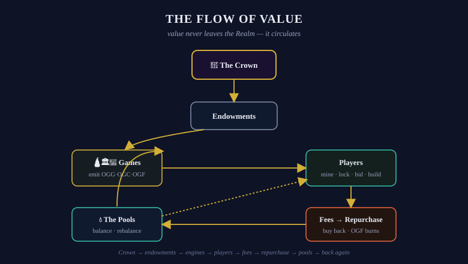

# 🔄 The Flow of Value

Every economy is a circuit. The Realm's is fully visible. This page traces one loop of it — from the Crown's vaults to your wallet and back through the market.

## The Crown

At the apex stands **the Crown** — the Mad OG 🔱, who struck the tokens; OG Bank 🏦, the Permanence that holds them; and OG Lab 🕋, the Agency that works them. On the Realm's first two days, the entire value of the Realm flowed from the Creator into the Bank's trust.

## The Endowments

The Bank released each token's endowment to its sworn Institution as it came of age: 60% of $OGG to the 🛕 Mine · 70% of $OGC to the 🏛️ Reserve · 80% of $OGF to the 🎰 Lottery · 70% of $OGA to the 🕋 Lab. The rest it bonded into the [pools](../physics/liquidity-pools.md) or holds in reserve.

## The Games Emit

Each Epoch, the engines release value to players:

* The **Mine** emits 1% of its remaining $OGG — to miners
* The **Reserve** emits a constant 274M $OGC — to the second-largest slot's allocators
* The **Lottery** releases an accelerating flood of $OGF — to its pools, and eventually its winners

## Players Pay to Play

Every interaction pays a fee under the [one difficulty law](../physics/difficulty.md) — gentle to the early, steeper as the crowd grows. Fees are the price of participation, and they do not vanish:

## The Fees Return

Each Game's fees flow to its [Repurchase Program](../games/repurchase-programs.md), which buys the Game's own token back from the open market: **$OGG returns to the Mine. $OGC returns to the Reserve. $OGF burns.** The market feels the bid; the engines feel the replenishment; the Fool feels the fire.

## The Pools Balance

All of this churn crosses the [Regulated Pools](../physics/liquidity-pools.md) — the permanent Realm and Eternal bonds, and the Lab's active Sanctioned liquidity. Every repurchase routes through them; every trade rebalances the ladder; every swap pays fees to the pools' participants — the Bank, the Lab, and the OGs beside them.

## The Circle, Whole

Crown → endowments → engines → players → fees → repurchase → market → pools → back again. Value never leaves the Realm; it circulates — and at every junction of the circuit, there is a place for an OG to stand and earn.

<figure><figcaption>The Flow of Value — value never leaves the Realm; it circulates</figcaption></figure>


Choose your junction. The [Paths of Play](../paths/README.md) name them all.


---

*✓ Verified by the Mad OG · UEC 702 (2026-06-06)*
