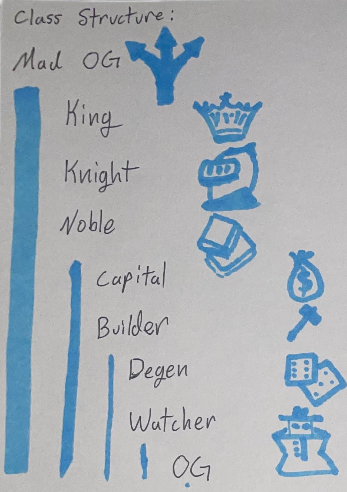

# 👤 Classes

OGs have the opportunity to assume various roles in the Realm as defined by Classes. These classes help to group the various participants of the Realm into common categories, referencing their status and level of participation within the Realm.

More information will be released on Classes in time, including criteria and opportunities within the Realm for each Class. However, generally noting:

* Ruler of the Realm is [**Mad OG**](../power/mad-og.md)
* Power is controlled by **Kings**.
* Loyalty resides with **Nobles**.
* Wealth flows through **Capitals**.
* Resources belong to **Builders**.
* Entrepreneurs are the **Degens**.
* Commoners of the Realm are **OG**.

<figure><figcaption></figcaption></figure>
