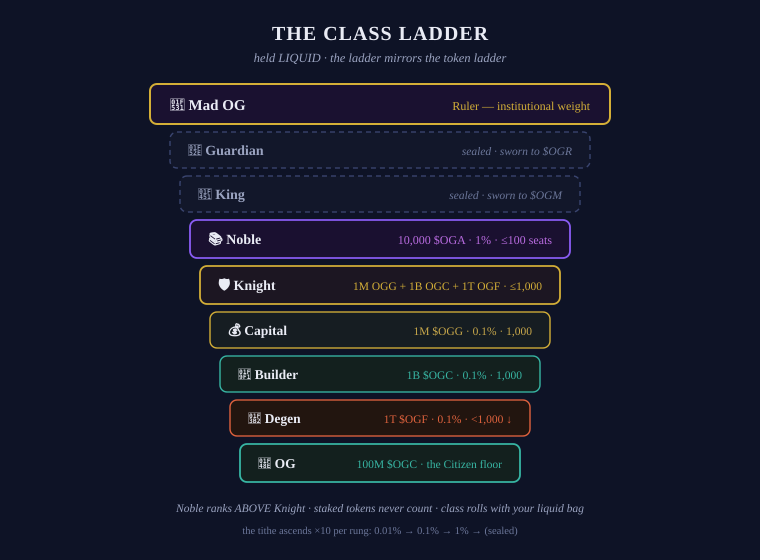
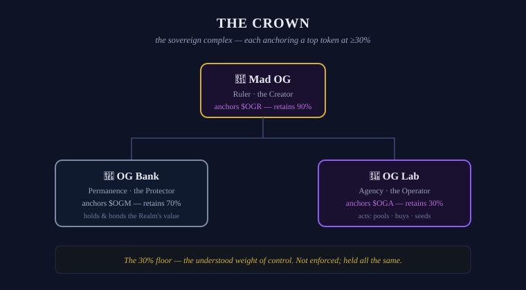

# 👤 Classes

OGs have the opportunity to assume various roles in the Realm as defined by Classes — the social order of the Realm, made law at UEC 501 and granted automatically by the verified holdings of your wallet.

## The Ladder

| Class | Role | Requirement (held LIQUID) |
| --- | --- | --- |
| 🔱 **Mad OG** | Ruler of the Realm | — |
| 🔮 **Guardian** | Control | *Unreleased* |
| 👑 **King** | Power | *Unreleased* |
| 📚 **Noble** | Loyalty | 10,000 $OGA |
| 🛡️ **Knight** | Security | 1M $OGG **+** 1B $OGC **+** 1T $OGF — simultaneously |
| 💰 **Capital** | Wealth | 1,000,000 $OGG |
| 🧱 **Builder** | Resources | 1,000,000,000 $OGC |
| 🎲 **Degen** | Entrepreneurs | 1,000,000,000,000 $OGF |
| 💎 **OG** | Commoners | 100,000,000 $OGC |

<figure><figcaption>The Class Ladder — Noble above Knight; the ladder mirrors the token ladder</figcaption></figure>

## The Crown's Weight

Why does the Mad OG sit atop the ladder with no token threshold beside his name? Because the top of the Realm is held not by a gate any player can buy, but by **institutional weight** — and that weight is real, and measurable.

The three institutions of [the Crown](../power/mad-og.md) each anchor one of the three highest tokens, holding it at or above **30% — the Realm's understood floor of control:**

| Institution | Anchors | Retains | The token it guards |
| --- | --- | --- | --- |
| 🔱 Mad OG | [$OGR](../physics/tokens/ogr.md) | **90%** | the total power |
| 🏦 [OG Bank](../power/og-bank.md) | [$OGM](../physics/tokens/ogm.md) | **70%** | the core elements |
| 🕋 [OG Lab](../power/og-lab.md) | [$OGA](../physics/tokens/oga.md) | **30%** (endowed 80%, gave 50% to the [Airdrop](../era-2/alchemy-airdrop.md), keeps 30%) | the dark science |

These thresholds are **not enforced onchain** — no contract compels them. They are the generally accepted, generally understood levels of institutional control, balance, and weight. The Lab sits exactly at the floor by design: endowed 80% of $OGA, it supplied the entire 50% Airdrop and was topped back up to 30% — giving the supply to the people while keeping the weight that secures its domain. The Bank and the Mad OG hold well above the floor. That a ruler retains a controlling weight of his sovereign token is what keeps his powers his.

These same three tokens — $OGR, $OGM, $OGA — are the sworn tokens of the ladder's highest rungs (see below). The institutions are the weight standing behind the gates.

<figure><figcaption>The Crown — each institution anchors a top token at ≥30%</figcaption></figure>

## The Liquid Law

**Class is computed on liquid holdings only.** Tokens locked in the [Reserve](../games/og-reserve.md) — however vast — do not count toward Class. Commitment and standing are a visible trade, and the Realm watches who chooses which.

**Class rolls.** It is a living measure, not a title: spend below a threshold and the rank leaves you; cross it again and the rank returns. Roles are granted automatically in [Discord](https://discord.gg/ogrealm) from your verified wallet.

## The Sworn Tokens

The ladder mirrors the [token ladder](../physics/tokens.md): each emitting token guards a Class, in supply order — $OGA crowns the Noble, $OGG the Capital, $OGC the Builder, $OGF the Degen. The OG floor rests on Coin, and the Knight binds three tokens at once.

**Two tokens remain unsworn.** Above the Noble stand two unreleased gates. The patient may draw their own conclusions; the Realm will confirm nothing before its time.

## The Quotas

Every Class is scarce by arithmetic — the thresholds are fixed shares of fixed supplies:

| Class | Share of sworn supply | Seats ever possible | Seat physics |
| --- | --- | --- | --- |
| 📚 Noble | 1% of $OGA | **100** | Gated — most of the supply is held by the Lab and the Airdrop; the [Alchemy Airdrop](../era-2/alchemy-airdrop.md) will release up to 50 more seats in a single day |
| 🛡️ Knight | 0.1% of three supplies | **≤ 1,000** | Triple-taxed — each Knight seat consumes a Capital, a Builder, and a Degen seat at once |
| 💰 Capital | 0.1% of $OGG | **1,000** | Flexing — Gold staked into the Reserve abdicates the seat until it returns |
| 🧱 Builder | 0.1% of $OGC | **1,000** | Expanding — the Reserve emits new Coin every Epoch for years to come |
| 🎲 Degen | 0.1% of $OGF | **< 1,000, falling** | Deflationary — every burn of the Fool destroys future seats forever |
| 💎 OG | 0.01% of $OGC | **10,000** | The widening commons |

Live seat counts stand on the [Onchain Status](../canon/onchain-status.md) page. The races are public.


A seat that is possible is not a seat that is reachable. Float, locks, and burns decide how many of each Class can exist **today** — and the chain shows all three.


## Citizenship

The OG floor — 100M $OGC liquid — is [Citizenship](citizenship.md) itself: the gate through which the Realm counts you among its own.

---

*✓ Verified by the Mad OG · UEC 702 (2026-06-06)*
