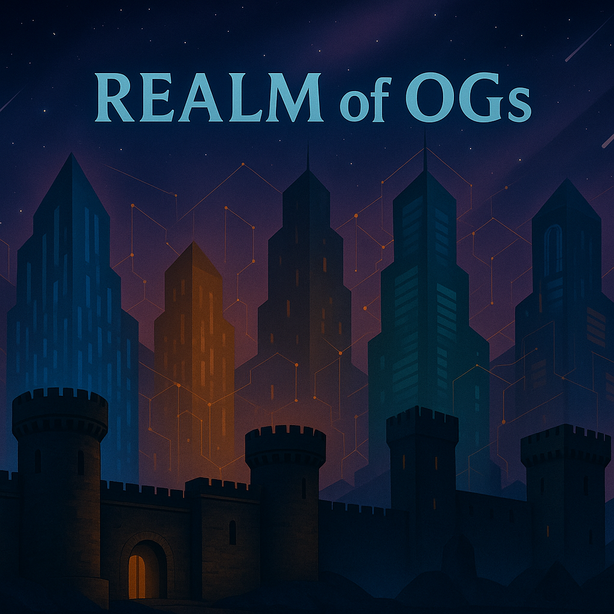

# ⏳ Timeline

<figure><figcaption></figcaption></figure>

## Pre-OG

* 01/01/24 - [Realm of OGs](power/realm-of-ogs.md) is founded
* 03/18/24 - [Discord](https://discord.gg/ogrealm) is created
* 07/05/24 - OG Realm wallet is funded - ([Solscan](https://solscan.io/tx/4Kwmo2fd7wcciTNmQKuSmyhQUGceVk6SvMhL41QVRtxeJ7p69jvfxurMn79aPTCPNzF4i5MbJDvhsrcGre5pzdJE))
* 07/05/24 - [Tokens](constructs/tokens/) are minted
  * $OGR is minted - ([Solscan](https://solscan.io/tx/52Pu6sohtqfpjYWqHgUADKKbbcJ93nJ853vBqjx3FyvGemhwL8fH91jWWCmTts1ncQVsy64UbeWQpPGbMjycoBpN))
  * $OGM is minted - ([Solscan](https://solscan.io/tx/2oQFweRXX1SGqZtMJbwuJbBpeZ7YScmgEWt9USqYtbfqoyQ3UMGuNLDuAaH8PEQ95cz3diYjkjSqJMo8vLHnBzBX))
  * $OGA is minted - ([Solscan](https://solscan.io/tx/35kfEBKLo6puEP8ESbbU3h2dKQdrmTmGJS7RHXdiyBGtwN2PCQN6n38AjZSCmjrwgVc6mP28NS9CJT1zW4xcKHd1))
  * $OGG is minted - ([Solscan](https://solscan.io/tx/pLYntYQV3UXJjshACfDycLQKS22DKSRGe9ShtHZf6qjwBnfVGNxu8LgSrdvH5CJ3MaV4hXAFSwrsGUQgRNoFV7A))
  * $OGC is minted - ([Solscan](https://solscan.io/tx/5LfaL3g25Ke4zCceunRCvj55XRUfVqTV3K5BfwyjbHRJ6d57bWzs9cF9Diey4cavJcw9HTWVbeFcnccjodaWh1ZK))
  * $OGF is minted - ([Solscan](https://solscan.io/tx/hhkKT1dSdf1HXiZphY1QGY39E9sxTaDY9szTJ1X2UMKLb365LzC6gdaihup7RP6veAFJt1pwFQLuT8ziyQarYY8))
* 07/06/24 - [OG Bank](institutions/og-bank.md) is established
* 07/06/24 - OG Bank wallet is funded - ([Solscan](https://solscan.io/tx/3pqsyiYmyaGcA2zuYbZsfov9XWwyCyc9ogY349dcX4RzPkbhCKzWENdjJoNyKkTLKB5ApmMBfvv59aERb2pG5t43))
* 07/06/24 - [OG Lab](institutions/og-lab.md) is established
* 07/06/24 - OG Lab wallet is funded - ([Solscan](https://solscan.io/tx/2rX7UiDBs66fzuenoQFb95js6S7yKSib9ub8ZFiN4FPzb7df1e8XDszwyynKgSsm6Cy3q1MZQmHFEi8vWHAExfcx))
* 07/06/24 - $OGF is transferred to OG Bank - ([Solscan](https://solscan.io/tx/4FiBmNFWUJVVMsaRgpimGNvYftWymFqU2HZNzJcEQQe5bF7F47aSP1Vq7c3cZV7VFH3CyszDTiV6B2k9UXBtjUnA))
* 07/06/24 - $OGC is transferred to OG Bank - ([Solscan](https://solscan.io/tx/U25Kvw88btCQBpZ539ypjTo8RoBAePnW5cCEynbm9vf9CpcXyKG4uu8Yfu8EsqQi25MJSQ8eRuFM6bdtnWiuJ5r))
* 07/06/24 - $OGG is transferred to OG Bank - (Solscan)
* 07/06/24 - $OGA is transferred to OG Bank - (Solscan)
* 07/06/24 - $OGM is transferred to OG Bank - (Solscan)
* 07/06/24 - $OGR is transferred to OG Bank - (Solscan)
* 07/07/24 - [Liquidity Pools](constructs/liquidity-pools/) are created
* 07/28/24 - [OG Mine](institutions/og-mine.md) is established
* 07/31/24 - [$OGG](constructs/tokens/usdogg-og-gold.md) emissions begin
* 11/18/24 - [OG Reserve](institutions/og-reserve.md) is established
* 11/19/24 - [$OGG](constructs/tokens/usdogg-og-gold.md) locking begins
* 11/20/24 - [$OGC](constructs/tokens/usdogc-og-coin.md) emissions begin
* 11/28/24 - [Repurchase Program](constructs/repurchase-programs.md) is launched
* 12/21/24 - [Docs](broken-reference) are published

## Year 1  (2025)

* 01/06/25 - [Discord](https://discord.gg/ogrealm) is opened to public
* 02/03/25 - [$OGC](constructs/tokens/usdogc-og-coin.md) for fees enabled
* 05/26/25 - [Knowledge Base](constructs/knowledge-base.md) launched
* 06/16/25 - Discord Price Bots launched
* 07/15/25 - [OG Lottery](institutions/og-lottery.md) is established \[tentative]

