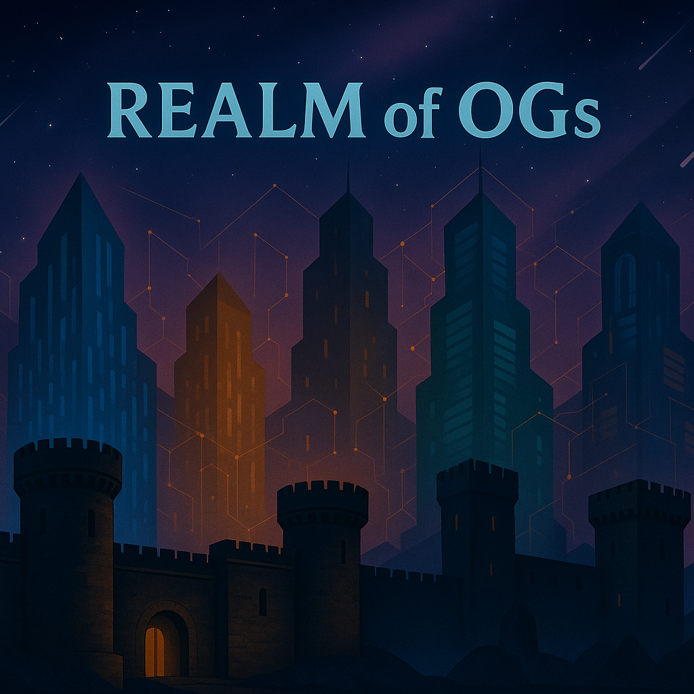

# ⏳ Timeline

<figure><figcaption></figcaption></figure>

## Pre-OG

Realm is founded. Mad OG harnesses the energy of the real world to open a portal into a place of infinite blockspace that we now know as the Realm of OGs.

* 01/01/24 - [Realm of OGs](../) is founded
* 03/18/24 - [Discord](https://discord.gg/ogrealm) is created

Tokens are minted. In order to facilitate the mechanics of all activity to be had within the Realm, Mad OG divided the entire value of the Realm into 6 tokens.

* 07/05/24 - OG Realm wallet is funded - ([Solscan](https://solscan.io/tx/4Kwmo2fd7wcciTNmQKuSmyhQUGceVk6SvMhL41QVRtxeJ7p69jvfxurMn79aPTCPNzF4i5MbJDvhsrcGre5pzdJE))
* 07/05/24 - OG Realm tokens are minted
  * OG Realm mints 1 $OGR - ([Solscan](https://solscan.io/tx/52Pu6sohtqfpjYWqHgUADKKbbcJ93nJ853vBqjx3FyvGemhwL8fH91jWWCmTts1ncQVsy64UbeWQpPGbMjycoBpN))
  * OG Realm mints 1,000 $OGM - ([Solscan](https://solscan.io/tx/2oQFweRXX1SGqZtMJbwuJbBpeZ7YScmgEWt9USqYtbfqoyQ3UMGuNLDuAaH8PEQ95cz3diYjkjSqJMo8vLHnBzBX))
  * OG Realm mints 1,000,000 $OGA - ([Solscan](https://solscan.io/tx/35kfEBKLo6puEP8ESbbU3h2dKQdrmTmGJS7RHXdiyBGtwN2PCQN6n38AjZSCmjrwgVc6mP28NS9CJT1zW4xcKHd1))
  * OG Realm mints 1,000,000,000 $OGG - ([Solscan](https://solscan.io/tx/pLYntYQV3UXJjshACfDycLQKS22DKSRGe9ShtHZf6qjwBnfVGNxu8LgSrdvH5CJ3MaV4hXAFSwrsGUQgRNoFV7A))
  * OG Realm mints 1,000,000,000,000 $OGC - ([Solscan](https://solscan.io/tx/5LfaL3g25Ke4zCceunRCvj55XRUfVqTV3K5BfwyjbHRJ6d57bWzs9cF9Diey4cavJcw9HTWVbeFcnccjodaWh1ZK))
  * OG Realm mints 1,000,000,000,000,000 $OGF - ([Solscan](https://solscan.io/tx/hhkKT1dSdf1HXiZphY1QGY39E9sxTaDY9szTJ1X2UMKLb365LzC6gdaihup7RP6veAFJt1pwFQLuT8ziyQarYY8))

OG Bank is established. The first of the Realm's Institutions to be established, OG Bank is tasked with the duty of protecting the Realm's value by safeguarding nearly all of the Realm tokens.

* 07/06/24 - OG Bank wallet is funded - ([Solscan](https://solscan.io/tx/3pqsyiYmyaGcA2zuYbZsfov9XWwyCyc9ogY349dcX4RzPkbhCKzWENdjJoNyKkTLKB5ApmMBfvv59aERb2pG5t43))
* 07/06/24 - OG Bank wallet receives Realm tokens
  * OG Realm transfers 10% $OGR is to OG Bank - ([Solscan](https://solscan.io/tx/d6EbhacWqvuVJrNjM4A7qdX2SZpuvY3KHpNKGG5oQo8tK2ZkiBMELT2L8pFtoDVtifNYe8ZLJX3LKVLbnSkwt4h))
  * OG Realm transfers 100% $OGM to OG Bank - ([Solscan](https://solscan.io/tx/4ganH5L4xQJX3bjUCQ3k5rrrH2cvLtSjbJrrDJ8MdfVnYr9DMT7esnGHUQiqhsm3bKeDBZ84TK8juzxghkrSfFrK))
  * OG Realm transfers 100% $OGA to OG Bank - ([Solscan](https://solscan.io/tx/4TqZvQDTy8DAXahwemuNE1q3fLL4HRC3ip6NiUvyHh6MTbytRUBfDymyBMNiRT2hAk9ocUyS5xssWKj5e6oVtD1Y))
  * OG Realm transfers 100% $OGG to OG Bank - ([Solscan](https://solscan.io/tx/eRmpJw1AKaLhewmsHjyf6pnEaPV1MwE5RS783Y6LW6horT1Fr9Jm3UZQg7mu4UwzCLCPth4tKNSHeHpeWxCWuLB))
  * OG Realm transfers 100% $OGC to OG Bank - ([Solscan](https://solscan.io/tx/U25Kvw88btCQBpZ539ypjTo8RoBAePnW5cCEynbm9vf9CpcXyKG4uu8Yfu8EsqQi25MJSQ8eRuFM6bdtnWiuJ5r))
  * OG Realm transfers 100% $OGF to OG Bank - ([Solscan](https://solscan.io/tx/4FiBmNFWUJVVMsaRgpimGNvYftWymFqU2HZNzJcEQQe5bF7F47aSP1Vq7c3cZV7VFH3CyszDTiV6B2k9UXBtjUnA))

OG Lab is established. A relatively unknown and mysterious new Institution appears as OG Bank transfers the Realm's OG Alchemy ($OGA) token to OG Lab.

* 07/06/24 - OG Lab wallet is funded - ([Solscan](https://solscan.io/tx/2rX7UiDBs66fzuenoQFb95js6S7yKSib9ub8ZFiN4FPzb7df1e8XDszwyynKgSsm6Cy3q1MZQmHFEi8vWHAExfcx))
* 07/06/24 - OG Bank transfers 70% $OGA to OG Lab - ([Solscan](https://solscan.io/tx/2dSNQkLGfqroubWXJwH32CUwsQ7Yav1ejF6F2u8YaMvHnebDfYFGVZL9ySLnKfPWE8ATMjUcoVjYRuJSjNLadp3c))

Realm Pools are created. OG Bank integrates a framework for the entire token-physics of the Realm by bonding the 6 tokens to eachother permanently, unifying the tokens and establishing the hierarchy.

* 07/07/24 - Realm Pools are created
  * OG Bank adds 10% $OGR and 10% $OGM to $OGR-$OGM LP - ([Solscan](https://solscan.io/tx/4HwgLeanrXZM2L9SqhZsAiNsEwfmhnRogTXY42goDNVZrxLWPVrQKWCXCWQYHTgo9GNh3SaJTnhgiaMHBraeEUZ))
  * OG Bank adds 10% $OGM and 10% $OGA to $OGM-$OGA LP - ([Solscan](https://solscan.io/tx/3a7SW13DYRnLoV944c1xbojAWpqkXAoEPwm2MRmDjSt6oRsh9JUP2aLB62xqmcgye4ogRGywWKuSukTXA3z3P5Ky))
  * OG Bank adds 10% $OGA and 10% $OGG to $OGA-$OGG LP - ([Solscan](https://solscan.io/tx/4dsQEx27uzBSS5kxRTRMS9e5vLzKDSicihC4rEMN9Se5SCytxuFoKKSfcH6YcXdGfFpVT8sYvLmpcnt8B5ePRDhF))
  * OG Bank adds 10% $OGG and 10% $OGC to $OGG-$OGC LP - ([Solscan](https://solscan.io/tx/2NwXMfSZdbmv5DL7P9qsSqjokjG5aZ1TBSHD66ak7etGFgwwa63SktefhK6VrsRPFuiZg7bcGhESiynDSZHBpvvR))
  * OG Bank adds 10% $OGC and 10% $OGF to $OGC-$OGF LP - ([Solscan](https://solscan.io/tx/3s8qfc4kp14EgeGofxhESDj8uAu78wMu2edRXHoKnfAte6g6dbqRyXkfFfok8M554s6Pi25jZHB1fzJxvepTcEEE))
* 07/25/24 - Realm Pools are permanently locked
  * OG Bank burns $OGR-$OGM LP tokens - ([Solscan](https://solscan.io/tx/2m8D9C7YT55G9dsn4BtxfGjGhVDAoYp2LvZUQFJJpts5bzvRV2Uduz5MVpXAYdagj1w1NaXHJb2qAyDEdvQV4CfB))
  * OG Bank burns $OGM-$OGA LP tokens - ([Solscan](https://solscan.io/tx/4YuHU1ERLMBDnGtdGzGdJDxJywG6Xd9fm5pdDbhG7a8x2GDK8GXvWe3gXgm4EFfzkDfRJQ86zAEuFECJ9bXJ9ehr))
  * OG Bank burns $OGA-$OGG LP tokens - ([Solscan](https://solscan.io/tx/642U9quVnXrizMJNvcZXGvaNjDNf23vVF74Hxmew1n51odAou9CtmyTzFMntDKQtvjz6p3jTjA2ooKgwDUtkf6YB))
  * OG Bank burns $OGG-$OGC LP tokens - ([Solscan](https://solscan.io/tx/52ThA2YKiJsxHEEmyRFgrR52i8WUkcREo3tH5czLR2zN4tBBHtJD9G9yNF3WrrnGqHN3jgeEjRucDGZ5ow1kAmhh))
  * OG Bank burns $OGC-$OGF LP tokens - ([Solscan](https://solscan.io/tx/uYzLxJ1AWW2GUTKGxh8zRuDMoH1jBJh4WuYAqJBYRV75Tr7Nw5cn8NfuHnT85rnXvRi3rTLQMtVVaW2jGCWxkTF))

Eternal Pools are created. OG Bank connects the Realm's ecosystem to the real world by bonding 3 of the Realm tokens to outer-world assets, forging links and pathways to traditional value.

* 07/30/24 - $OGG-SOL LP
  * OG Bank adds 10% $OGG and SOL to $OGG-SOL LP - ([Solscan](https://solscan.io/tx/254bwRuhuyhX6Zn1QBejtVb1hwaZSKwK3LUxFUhy24bXYaUbQMMjU8nq3G7whqYKystMVN6cERiuKJRQeHLKzGxK))
  * OG Bank burns $OGG-SOL LP tokens - ([Solscan](https://solscan.io/tx/5itjTVukf8YX929Aixzrm5KtQrtEXdXTCG2SvhvV8y9BbELf41Y8S3TSJ35XvjucnRkaZHiHe3B8c3uGWc6tHHpD))
* 08/12/24 - $OGC-USDC LP
  * OG Bank adds 10% $OGC and USDC to $OGC-USDC LP - ([Solscan](https://solscan.io/tx/5siarwqtJPpxxAKoPzk29otU9CCpN1WQ4vAqMPsRtFT5D4ZVv7EXqPpmhkU5FgaDtYURwjnENMY6asUHp7DQ9Hez))
  * OG Bank burns $OGC-USDC LP tokens - ([Solscan](https://solscan.io/tx/5siarwqtJPpxxAKoPzk29otU9CCpN1WQ4vAqMPsRtFT5D4ZVv7EXqPpmhkU5FgaDtYURwjnENMY6asUHp7DQ9Hez))
* 12/08/24 - $OGM-cbBTC LP
  * OG Bank adds 10% $OGM and cbBTC to $OGM-cbBTC LP - ([Solscan](https://solscan.io/tx/2BnSeA7YnNW9jaRPf2TDfnXgjWGYHuJoLbePybQTAsqKt7wvjHfijgBYGvdkpFoVPzmNuEEx7siisZCenm7ihSBu))
  * OG Bank burns $OGM-cbBTC LP tokens - ([Solscan](https://solscan.io/tx/5wW6FZCuE5Vu4W7eTvq92LGmfLbGk4PUUzGycMwSfpasEnMT1sgHZBen7MJkpebp4dwi3UuSyX7BVovynY37HTzL))

OG Mine is established. The first of its kind, OG Mine is given the sole duty of fairly distributing the scarce reserves of the Realm, OG Gold ($OGG), and begins emissions.

* 07/25/24 - OG Mine wallet is funded - ([Solscan](https://solscan.io/tx/Ad4r1wQ8mmBP1HwvGMr7arXcYhiTwJBDdvRtX2xTvQknGUuHCTqksmxUnuybBeZ7H6d9UPZmYrcr4QUPhebUzCL))
* 07/25/24 - OG Bank transfers 60% $OGG to OG Mine - ([Solscan](https://solscan.io/tx/48YauWagRUPG6PH1VLvnnAeMTAV1M4h6dhzvXjphQJZFPJPpMwv6R4CzPdiN1YD7PSDpc9eq3FQBh9yXWKy8mDA6))
* 07/31/24 - OG Mine wallet loads 60% $OGG to OG Mine program - ([Solscan 1](https://solscan.io/tx/42WyxW6CMGUzjjv3XWAUFBzBJFiFJCPGJFa2V4shynExB2WgD4PruMj58k4L6CTHwJoBVLovoJhfYbgxPDc4CiVh), [Solscan 2](https://solscan.io/tx/4Hpj2NomgSW4oAsgf3w1svVxzrgvLUbqT7ENSicxQMufPG4cF8jQk7fe8AH6KTN3M1skpVCLZc6c4CMZinVt6aEu))
* 07/31/24 - [$OGG](../physics/tokens/usdogg-og-gold.md) emissions begin
* 11/28/24 - [Repurchase Program](../constructs/repurchase-programs.md) is launched

OG Reserve is established. Built to empower OGs within the Realm to secure and safeguard their hard-earned $OGG within OG Reserve, yielding them OG Coin ($OGC) for their stake.

* 11/18/24 - OG Reserve wallet is funded - ([Solscan](https://solscan.io/tx/4xANoD3jqdzjSuTMjqfZkBNvejxWzrj3xhWkKo6VzjuZs4GVa2iRYFKSGLm43N2Qe3PsJxLWQ3gBmtrFZvuQzNzN))
* 11/18/24 - OG Bank transfers 70% $OGC to OG Reserve - ([Solscan](https://solscan.io/tx/7BP7n4VaCUxwuGk62Zz1ZhPVPTaEJhNnVVoiDzN1UAJmT575efm6ZZd3iGrmeG8WswpiJjNYwsiCCpf7sHZA3uL))
* 11/19/24 - OG Reserve wallet loads 70% $OGC to OG Reserve program - ([Solscan](https://solscan.io/tx/Hfg7D5XC2WHtSCPU8atHxT4JSubWp1fgbS49phwdkMCivtrFgcswb3LEKpZn2ywXwfVXQAF6wVeEgdfjv1RnHTY))
* 11/19/24 - [$OGG](../physics/tokens/usdogg-og-gold.md) locking begins
* 11/20/24 - [$OGC](../physics/tokens/usdogc-og-coin.md) emissions begin
* 09/30/25 - [Repurchase Program](../constructs/repurchase-programs.md) is launched

Sanctioned Pools are created. OG Lab optimizes the Realm tokens' flow inside and outside of the Realm's ecosystem by establishing native liquidity for all remaining pools.

* 12/15/24 - Sanctioned Pools are created
  * OG Lab adds $OGR and SOL to $OGR-SOL LP - ([Solscan 1](https://solscan.io/tx/cUDMLJVw7yhobGKRsmaTeSYeQ2HfbWnzpVmuPPKxK3Zi58SCZkJ1aTTkuH3BczdGxRFwfxhKgTFD91rQ6o2H1gT), [Solscan 2](https://solscan.io/tx/VeRxPdYwRkXysE3Zykc1pUujUrZZ3dF1gdy9ETZGhqXDbQQTXFjL4oXE5EFDog2x7PF5RVQ2jtyZDbCZarDcJaL))
  * OG Lab adds $OGM and SOL to $OGM-SOL LP - ([Solscan 1](https://solscan.io/tx/53a71bgs7YRyPg7SM7kRoiEV7UpABpNq9J4SbtzsQ1miMtwSQPg5YFrtfD3fTBaD3ybdHKd7tbnJFSv6whJPb1HY), [Solscan 2](https://solscan.io/tx/5qq9wEBXTH8GJha11LiFF1DWTwHjsyyafdAHSbWQPoesyYtAgbz7gnKxV8e8sNZnKzs51jp2cn1xfTGzAh21yoCo))
  * OG Lab adds $OGA and SOL to $OGA-SOL LP - ([Solscan 1](https://solscan.io/tx/5jdYVEaGygoibbmTod1CXucoicD68GK27F1KYMLLduGjse5Q1AvjkXahAxDytoUud211gQEeEVSDasRBw7L1DLTs), [Solscan 2](https://solscan.io/tx/xpckpDzyYBwPY4PeB1Vr2rQNWB9B8WNmPDEJKHEaadhXmVazagLCCGHpKtyKkb7GogCKedyDUHt7oHn8iPmyj1g), [Solscan 3](https://solscan.io/tx/22tdv39wRroxsUFYh8PT6tm54iSgjd2M5C68qJvEynd2smSTdPXikEX6i6xVwpUDEsG755xBq5wZvHVA9HHTfDtv))
  * OG Lab adds $OGC and SOL to $OGC-SOL LP - ([Solscan 1](https://solscan.io/tx/4ZUZ8aXfpatfxjqzotyz5ggdbSTaZp71hsPNM9Z8su92TocBJdPjs5FyDpfYnaMeqaXCvnyCzDZk7UBrHiVK5yjV), [Solscan 2](https://solscan.io/tx/4YSJKuM2grLBdJg9uy675pQmVS9Rz4e5Q6sAMJiTtd3DzwEr2M6X9kUn8zva23rxhAoeRdM8BdqSR3CnH4WZ6FBd))
  * OG Lab adds $OGF and SOL to $OGF-SOL LP - ([Solscan](https://solscan.io/tx/RYqqWYNXeNePq2AdNZ6DYBZpcXYuvCJmu47ktmqdxbTae7ACDSuHzVB4V2iHyiVbk7GMBHpBHvNFAvnnqjs3SiA))
* 10/17/25 - V2 Sanctioned Pools are created
  * OG Lab adds $OGR and SOL to $OGR-SOL LP - ([Solscan](https://solscan.io/tx/2owQZmB971PixxbiawWjSLW4kTERZh9z7zCWQKVr5KjG4JJ2bMXuCv9V2bGxaDqXbeogRfqTfB3Ak7eQqEsuYakK))
  * OG Lab adds $OGM and SOL to $OGM-SOL LP - ([Solscan](https://solscan.io/tx/3gpcjjJFRpTDsHcJqL1cfEDaV6YgSrTY8RvJPVHWhxf4eMaCQigcASujU9N73pyQyigo2Z3ETDV58Vsf8UJY2PTS))
  * OG Lab adds $OGA and SOL to $OGA-SOL LP - ([Solscan](https://solscan.io/tx/4SgrDPbdrR1HdtKxj6tN2uH8BfwmRfMubMTvgcojpnCowqfhiffRNXH4wuXDnYUuBTEJNopRopj2HCawCaghRDJV))
  * OG Lab adds $OGC and SOL to $OGC-SOL LP - ([Solscan](https://solscan.io/tx/sLZUw8KKXAALdmpZCfevNdHUXkA3ZUpw5h8Uy5MjQG8VK8dUYu3ESn7GPkyJyBMZ9UAxN7rcueb33C9bC2XMus1))
  * OG Lab adds $OGF and SOL to $OGF-SOL LP - ([Solscan](https://solscan.io/tx/4USnVSnD51sQ8Xm2vvgd3qdHGP46BHj6JVAMBG5gUWYHv3GjVhtNzP7om9UbnTWUTm6L2ceXnqPhtoc7tQ2b4kM4))

OG Lab purchases $OGG. Continuing to showcase its diverse capabilities within the Realm's balance of power, OG Lab acquires a significant portion of the OG Gold ($OGG) supply.

* 12/16/24 - OG Lab market purchases 5% (50m) $OGG - ([Solscan](https://solscan.io/tx/2LGjvoNSpnAG8rT641H2eT8x4gkfNNc16axvFuFz4HYMgUbR7mz5dsSjNg3kEXK8dAVMEJkjXVwiTHGqeVL2hbM4))

Realm Docs are published. Casting the Realm in light and clarity, detailed Docs for the Realm arrived, democratizing information, wisdom, and choice for all OGs within.

* 12/21/24 - [Docs](/broken/pages/BD3RxyViPJ6ZXHIh4LMu) are published

## Year 1

Discord community expands. Further democratizing the Realm's access to new OGs as the Pre-OG Era waned, the walls of the Realm's Discord were opened for all.

* 01/06/25 - [Discord](https://discord.gg/ogrealm) is opened to public

Fees in $OGC introduced. Marking a significant moment in the Realm's development, OG Coin ($OGC) becomes the official unit of exchange, powering all of the Realm's exchange.

* 02/03/25 - [$OGC](../physics/tokens/usdogc-og-coin.md) for fees enabled

Artificial Intelligence is integrated. Complexities of the Realm's information and balance spur an effort to help simplify the tools and guidance available to OGs old and new.

* 05/23/25 - [Knowledge Base](../constructs/knowledge-base.md) launched
* 05/26/25 - Jester (NPC) launched

Live token price integration. Emerging as a new critical data point with the Realm for all players and entities, live market data around the Realm's tokens is integrated.

* 06/16/25 - Discord Price Bots launched

OG Lottery is established. The Realm's new high-stakes Institution arrives to test the primal urges of OGs, as OG Lottery begins releasing and burning OG Fool ($OGF).

* 03/05/25 - OG Lottery wallet is funded - ([Solscan](https://solscan.io/tx/2iwb3cVcmchuYHayb4139aYsyySB2fnP2gbqKz8i8fRKTfMZSeQ52eYbXqmpBvpSa7Y5Nx1qLEjVWE42VfTRXnyE))
* 03/05/25 - OG Bank transfers 80% $OGF to OG Lottery - ([Solscan 1](https://solscan.io/tx/3YTyK5hKouuiG9guroeABoRAcbvvg2w9pWvbhYsdrn1nrr79E5ZfZpQxaC7rqEK3FbM55ACF9AsmsN3SMUdxLoJJ), [Solscan 2](https://solscan.io/tx/5qG5cxcJmiovXmhVhq1BWApm6ByywWPQ3XJv1anDUTZNAD5WcuPmjcfcY5qkvV8EbZH4siPgJ9YCZ6y1GmY28cqq))
* 09/09/25 - OG Lottery wallet loads 80% $OGF to OG Lottery program - ([Solscan](https://solscan.io/tx/3ztndtSm993yFKRcEzMGVMGEiS8hitLQgtGmcHD8woixF81MMcjoC9bEuuEWawWitVuvoqXE9mgNksWTERGMsCRc))
* 09/10/25 - [$OGF](../physics/tokens/usdogf-og-fool.md) emissions begin
* 10/01/25 - [Repurchase Program](../constructs/repurchase-programs.md) is launched
* 11/17/25 - OG Lottery is rebooted with bug fixes

